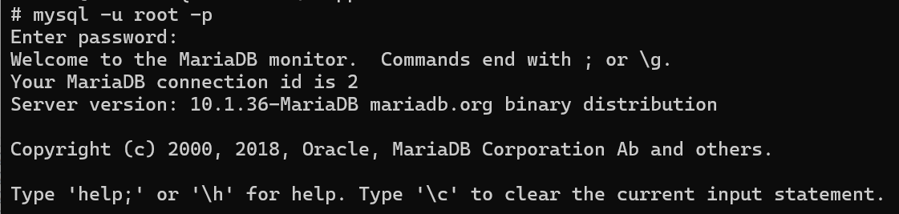
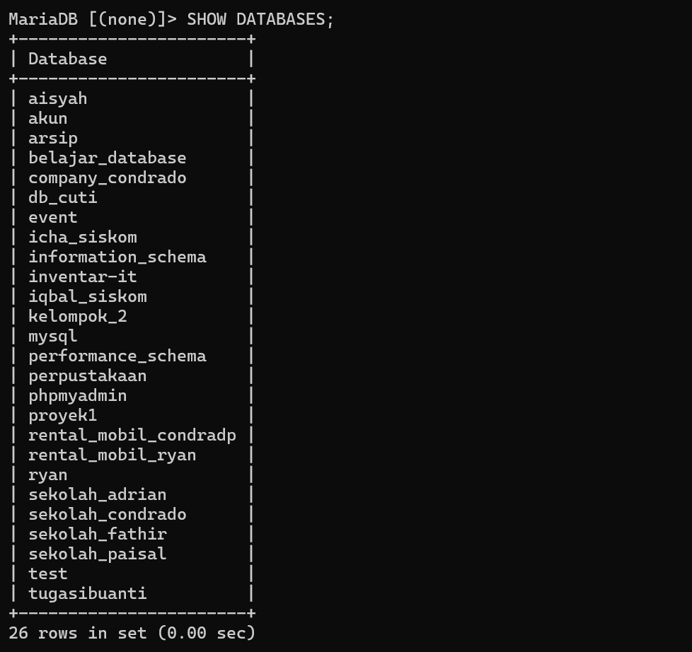
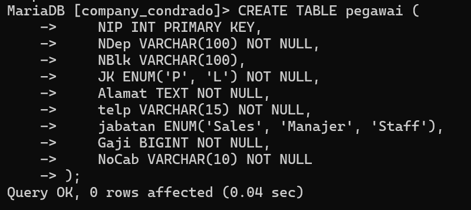
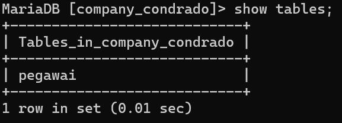
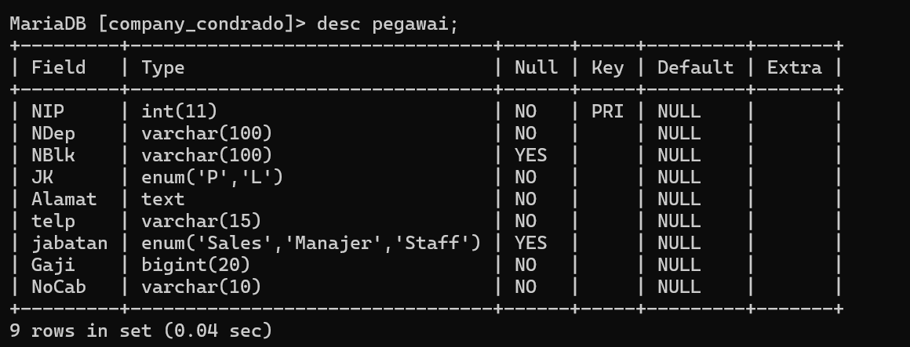
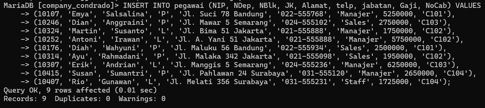
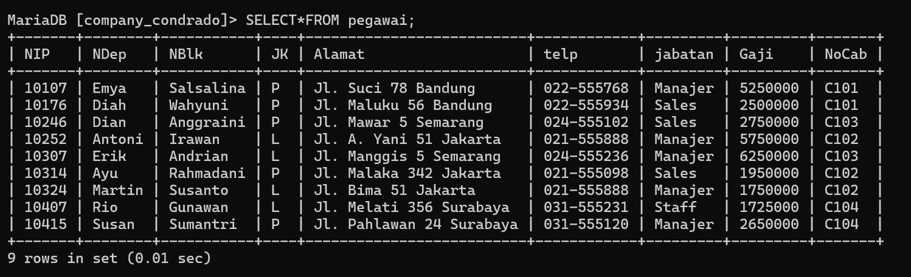

Praktek kali ini adalah membuat sebuah database perusahaan dengan tabel pegawai didalamnya. Untuk merealisasikannya, kita perlu membuat database untuk menampung tabel pegawai kita. Masuk ke aplikasi XAMPP, klik start pada tombol MySQL. Setelah menyala, klik tombol shell untuk masuk ke command promp.

Langkah-langkah pembuatan database:
1. Ketik `mysql -u root -p` dengan demikian kita sudah masuk ke dalam server lokal kita


2. Buat database dengan nama company_namaku dalam praktek kali ini saya membuatnya dengan nama company_condrado
```sql
CREATE DATABASE company_condrado;
```
penjelasan:
- `CREATE DATABASE`: Ini adalah perintah SQL yang digunakan untuk membuat database baru.
- `company_condrado`: Ini adalah nama dari database yang akan dibuat.

untuk melihat hasil dari database yang dibuat bisa dengan menggunakan perintah `show databases;`


3. Jika sudah memastikan bahwa database berhasil dibuat, sekarang adalah menggunakan database tersebut untuk dimasukan tabel didalmnnya, menggunakan perintah `use` lalu diikuti nama database yang akan digunakan.
```sql
USE company_condrado;
```
Penjelasan:
- `USE`: Ini adalah perintah SQL yang digunakan untuk memilih database yang akan digunakan.
- `company_condrado`: Ini adalah nama dari database yang akan dipilih.

Jika berhasil maka hasilnya akan sebagai berikut:


4. Sekarang kita akan membuat tabel di dalam database `company_condrado` ini dengan menggunakan perintah `create table` diikuti oleh nama tabel yang ingin kita buat
```sql
CREATE TABLE pegawai (
    NIP INT PRIMARY KEY,
    NDep VARCHAR(100) NOT NULL,
    NBlk VARCHAR(100),
    JK ENUM('P', 'L') NOT NULL,
    Alamat TEXT NOT NULL,
    telp VARCHAR(15) NOT NULL,
    jabatan ENUM('Sales', 'Manajer', 'Staff'),
    Gaji BIGINT NOT NULL,
    NoCab VARCHAR(10) NOT NULL
);
```
Penjelasan:
- `CREATE TABLE pegawai`: Bagian ini mendefinisikan bahwa kita akan membuat tabel baru bernama `pegawai`.
- `NIP INT PRIMARY KEY`: Kolom `NIP` bertipe data `INT` dan berfungsi sebagai kunci utama (PRIMARY KEY) dari tabel. Ini berarti setiap nilai dalam kolom ini harus unik dan tidak boleh kosong (NULL).
- `NDep VARCHAR(100) NOT NULL`: Kolom `NDep` bertipe data `VARCHAR` dengan panjang maksimum 100 karakter dan tidak boleh kosong (NOT NULL).
- `NBlk VARCHAR(100)`: Kolom `NBlk` bertipe data `VARCHAR` dengan panjang maksimum 100 karakter. Kolom ini bisa bernilai NULL karena tidak ada penanda `NOT NULL`.
- `JK ENUM('P', 'L') NOT NULL`: Kolom `JK` bertipe data `ENUM` dengan pilihan nilai 'P' (perempuan) atau 'L' (laki-laki) dan tidak boleh kosong (NOT NULL).
- `Alamat TEXT NOT NULL`: Kolom `Alamat` bertipe data `TEXT` dan tidak boleh kosong (NOT NULL).
- `telp VARCHAR(15) NOT NULL`: Kolom `telp` bertipe data `VARCHAR` dengan panjang maksimum 15 karakter dan tidak boleh kosong (NOT NULL).
- `jabatan ENUM('Sales', 'Manajer', 'Staff')`: Kolom `jabatan` bertipe data `ENUM` dengan pilihan nilai 'Sales', 'Manajer', atau 'Staff'. Kolom ini bisa bernilai NULL karena tidak ada penanda `NOT NULL`.
- `Gaji BIGINT NOT NULL`: Kolom `Gaji` bertipe data `BIGINT` dan tidak boleh kosong (NOT NULL).
- `NoCab VARCHAR(10) NOT NULL`: Kolom `NoCab` bertipe data `VARCHAR` dengan panjang maksimum 10 karakter dan tidak boleh kosong (NOT NULL).

Hasil:


5. Untuk melihat tabel yang telah dibuat sudah terdaftar didalam database, bisa gunakan perintah `show tables`. Jika tabel yang dibuat sudah berhasil maka akan terdata di database tersebut.


6. Setelah memastikan bahwa tabel berhasil dibuat maka sekarang kita akan melihat struktur dari tabel yang sudah kita buat menggunakan perintah `desc table` kemudian diikuti oleh nama tabel yang tadi dibuat.
```sql
DESC table pegawai;
```
Penjelasan
- `DESC`: Singkatan dari `DESCRIBE`, perintah ini digunakan untuk mendapatkan informasi tentang struktur sebuah tabel dalam database.
- `pegawai`: Nama tabel yang ingin Kita lihat strukturnya.
Hasil:


7. Setelah memastikan struktur tabel sudah tepat, saatnya memasukan data pada tabel yang telah dibuat. Untuk datanya menggunakan refrensi sebagai berikut:


Untuk merealisaskannya kita akan memasukannya dengan perintah `INSERT INTO` kemudiaan diikuti dengan nama tabel dan kemudiaan perintah `VALUES` diikuti oleh data-datanya.
```sql
INSERT INTO pegawai (NIP, NDep, NBlk, JK, Alamat, telp, jabatan, Gaji, NoCab) 
VALUES (10107, 'Emya', 'Salsalina', 'P', 'Jl. Suci 78 Bandung', '022-555768', 'Manajer', 5250000, 'C101'),
(10246, 'Dian', 'Anggraini', 'P', 'Jl. Mawar 5 Semarang', '024-555102', 'Sales', 2750000, 'C103'),
(10324, 'Martin', 'Susanto', 'L', 'Jl. Bima 51 Jakarta', '021-555888', 'Manajer', 1750000, 'C102'),
(10252, 'Antoni', 'Irawan', 'L', 'Jl. A. Yani 51 Jakarta', '021-555888', 'Manajer', 5750000, 'C102'),
(10176, 'Diah', 'Wahyuni', 'P', 'Jl. Maluku 56 Bandung', '022-555934', 'Sales', 2500000, 'C101'),
(10314, 'Ayu', 'Rahmadani', 'P', 'Jl. Malaka 342 Jakarta', '021-555098', 'Sales', 1950000, 'C102'),
(10307, 'Erik', 'Andrian', 'L', 'Jl. Manggis 5 Semarang', '024-555236', 'Manajer', 6250000, 'C103'),
(10415, 'Susan', 'Sumantri', 'P', 'Jl. Pahlawan 24 Surabaya', '031-555120', 'Manajer', 2650000, 'C104'),
(10407, 'Rio', 'Gunawan', 'L', 'Jl. Melati 356 Surabaya', '031-555231', 'Staff', 1725000, 'C104');
```
Penjelasan:
- `INSERT INTO pegawai (NIP, NDep, NBlk, JK, Alamat, telp, jabatan, Gaji, NoCab)`: Bagian ini mendefinisikan bahwa kita akan memasukkan data ke dalam tabel `pegawai`. Kolom-kolom yang akan diisi adalah `NIP`, `NDep`, `NBlk`, `JK`, `Alamat`, `telp`, `jabatan`, `Gaji`, dan `NoCab`.
- `VALUES`: Kata kunci ini menandakan bahwa nilai-nilai yang akan dimasukkan ke dalam kolom-kolom yang telah disebutkan di atas akan mengikuti setelahnya.
- `(10107, 'Emya', 'Salsalina', 'P', 'Jl. Suci 78 Bandung', '022-555768', 'Manajer', 5250000, 'C101')`: Ini adalah nilai-nilai untuk baris pertama yang akan dimasukkan ke dalam tabel `pegawai`.
    - `10107`: Nilai untuk kolom `NIP`
    - `'Emya'`: Nilai untuk kolom `NDep`
    - `'Salsalina'`: Nilai untuk kolom `NBlk`
    - `'P'`: Nilai untuk kolom `JK`
    - `'Jl. Suci 78 Bandung'`: Nilai untuk kolom `Alamat`
    - `'022-555768'`: Nilai untuk kolom `telp`
    - `'Manajer'`: Nilai untuk kolom `jabatan`
    - `5250000`: Nilai untuk kolom `Gaji`
    - `'C101'`: Nilai untuk kolom `NoCab`
- Setiap baris berikutnya dipisahkan oleh tanda koma `,`, dan memiliki format yang sama dengan baris pertama, dengan nilai-nilai yang sesuai untuk setiap kolom.

Hasil:


8. Sekarang setelah memasukan data didalam tabel, saatnya untuk melihat tabel dengan data yang sudah dimasukkan didalamnya dengan perintah `SELECT * FROM` kemudian diikuti oleh nama tabelnya. 
```sql
SELECT*FROM pegawai;
```
Penjelasan:
- `SELECT`: Ini adalah kata kunci yang digunakan untuk mengambil data dari database.
- `*`: Tanda bintang (`*`) adalah wildcard yang menunjukkan bahwa semua kolom dalam tabel harus disertakan dalam hasil kueri.
- `FROM`: Kata kunci ini digunakan untuk menunjukkan tabel dari mana data akan diambil.
- `pegawai`: Nama tabel dari mana data akan diambil.

Hasil:

