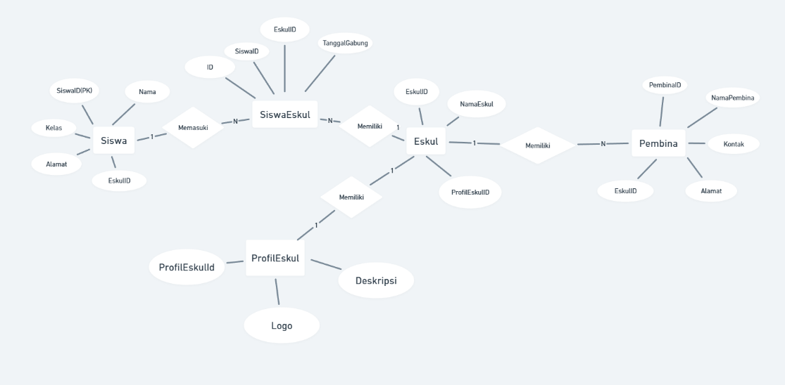
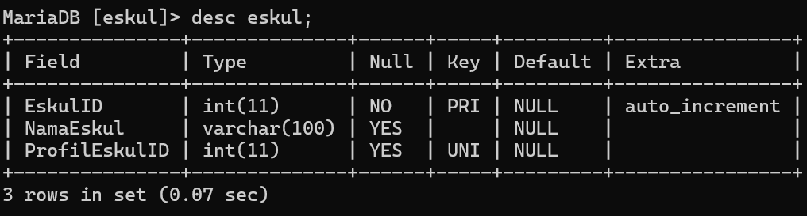
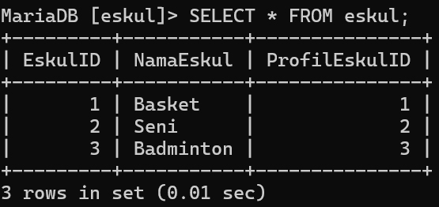
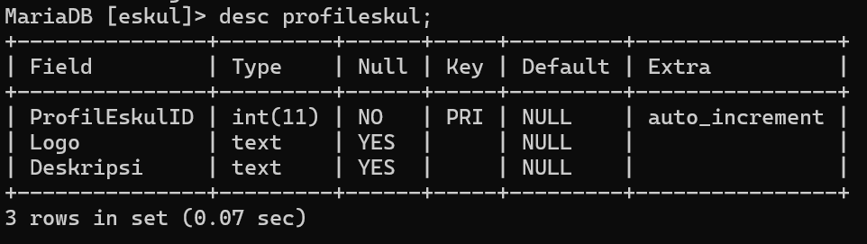
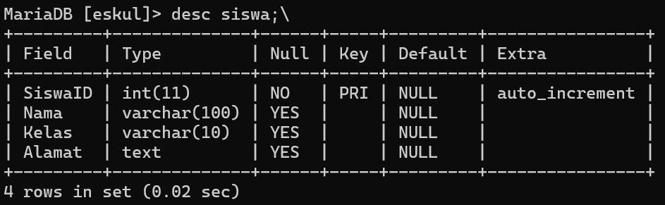
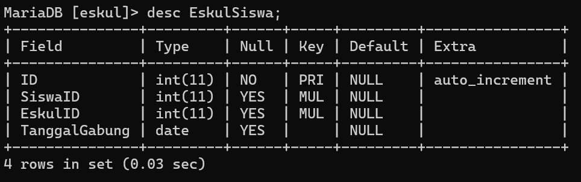
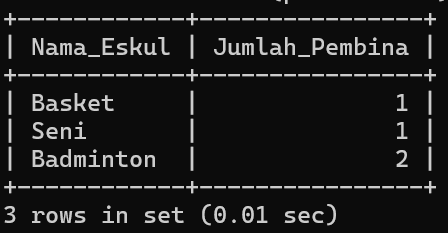

# SOAL 1
## Struktur ERD dan Database

**Database:**


**Struktur ERD:**


Untuk database di kelompok kami yaitu merancang database dan erd tentang eskul sekolah. di database ini terdiri dari 5 tabel yaitu tabel "eskul", tabel "profileskul", tabel "siswa", tabel "pembina" dan tabel "SiswaEskul". 

**Hubungan dan Kardinalitas:**
1. **Siswa - SiswaEskul**
   - Kardinalitas: Satu ke Banyak (One-to-Many)
   - Penjelasan:  Seorang siswa(Siswa) dapat memasuki lebih dari satu baris data yang berhubungan dengan tabel SiswaEskul.
2. **SiswaEskul - Eskul**
   - Kardinalitas: Banyak ke Satu (Many-to-One)
   - Penjelasan:  Sebuah eskul(Eskul) dapat memiliki lebih dari satu baris data yang berhubungan dengan tabel SiswaEskul.
1. **Eskul - Pembina**
   - Kardinalitas: Banyak ke Satu (Many-to-One)
   - Penjelasan: Setiap Eskul memiliki satu Pembina (pembimbing), tetapi seorang Pembina bisa membimbing banyak Eskul. Oleh karena itu, baris data pembina pada tabel eskul dapat lebih dari satu, dan lebih dari satu baris data id_pembina pada tabel eskul berhubungan dengan satu baris data pada tabel pembina, yaitu pada id_pembina.
2. **eskul - profileskul**
   - Kardinalitas: satu ke satu (One-to-One) 
   - Penjelasan: Sebuah Eskul (Tabel Eskul) hanya memiliki satu baris data yang berhubungan dengan tabel profileskul, dimana baris data yang behubungan dengan profileskul hanya dapat dihubungkan dengan satu baris data di tabel Eskul. Hal ini dikarenakan, **Sebuah eskul memiliki sebuah profil dan profil sebuah eskul tidak mungkin dimiliki oleh 2 eskul secara bersamaan** .

Berikut penjelasan dari masing-masing tabel:
### Tabel Eskul

**Struktur Query:**
```sql
CREATE TABLE Eskul (
EskulID INT PRIMARY KEY AUTO_INCREMENT,
NamaEskul VARCHAR(100),
ProfilEskulID INT UNIQUE,
CONSTRAINT fk_Eskul_ProfilEskul FOREIGN KEY (ProfilEskulID) REFERENCES ProfilEskul(ProfilEskulID) ON DELETE CASCADE
);
```
hasil:


Tabel eskul adalah tabel utama yang berperan penting dalam database ini. Tabel ini berisi macam-macam eskul yang ada pada sekolah. Tabel ini terdiri dari 4 kolom yaitu kolom "EskulID", kolom "NamaEskul", kolom "ProfilEskul",. Untuk Forgine keynya, tabel ini berelasi dengan tabel **ProfilEskul**, dimana tiap eskul memiliki satu ProfilEskul dan diinisialisasikan dengan "ProfilEskulID" yang diambil dari tabel **ProfilEskul**.

**Penjelasan Query**:

**1. CREATE TABLE Eskul**
- **Fungsi**: Membuat tabel baru bernama `Eskul` yang akan digunakan untuk menyimpan data ekstrakurikuler.
- **Kolom-kolom yang didefinisikan dalam tabel**: `EskulID`, `NamaEskul`, dan `ProfilEskulID`.
**2. EskulID INT PRIMARY KEY**
- **Kolom**: `EskulID`
    - Tipe data: **INT** (Integer), digunakan untuk menyimpan ID unik untuk setiap ekstrakurikuler.
    - **PRIMARY KEY**: Menandakan bahwa kolom ini adalah **Primary Key**, sehingga nilainya harus unik dan tidak boleh `NULL`.
**3. NamaEskul VARCHAR(100)**
- **Kolom**: `NamaEskul`
    - Tipe data: **VARCHAR(100)**, digunakan untuk menyimpan nama ekstrakurikuler dalam bentuk teks dengan panjang maksimum 100 karakter.
    - Contoh: "Basket", "Seni", "Badminton".
**4. ProfilEskulID INT UNIQUE**
- **Kolom**: `ProfilEskulID`
    - Tipe data: **INT** (Integer), digunakan untuk menyimpan ID profil eskul.
    - **Relasi**: Kolom ini adalah **Foreign Key** yang merujuk ke kolom `ProfilEskulID` di tabel **ProfilEskul**.
    - **UNIQUE**: Menandakan bahwa setiap profil hanya bisa terhubung dengan satu eskul.
**5. CONSTRAINT fk_Eskul_ProfilEskul**
- **Fungsi**: Membuat constraint atau batasan pada kolom `ProfilEskulID` untuk menjadikannya **Foreign Key**.
- **Nama Constraint**: `fk_Eskul_ProfilEskul`.
- **Foreign Key**:
    - Kolom `ProfilEskulID` di tabel `Eskul` merujuk ke kolom `ProfilEskulID` di tabel **ProfilEskul**.
    - Relasi ini menunjukkan bahwa setiap ekstrakurikuler memiliki profil yang terkait di tabel **ProfilEskul**.
**6. ON DELETE CASCADE**
- **Fungsi**: Menentukan perilaku ketika data di tabel **ProfilEskul** dihapus.
- **`CASCADE`**: Jika data profil dihapus dari tabel **ProfilEskul**, maka data terkait di tabel **Eskul** juga akan dihapus.
    - **Alasan**: Ini memastikan integritas data, sehingga tidak ada eskul yang tidak memiliki profil.
    
**Isi Data Tabel Eskul:**


### Tabel ProfilEskul

**Struktur Query:**
```sql
CREATE TABLE ProfilEskul (
    ProfilEskulID INT PRIMARY KEY AUTO_INCREMENT,
    Logo TEXT,
    Deskripsi TEXT
);
```
**Hasil:**

Tabel profileskul adalah tabel yang berisi profil dari tiap eskul. Tabel ini terdiri dari 3 kolom yaitu kolom "ProfilEskulID",kolom "Logo", dan kolom "Deskripsi".

**Penjelasan:**
**1. CREATE TABLE ProfilEskul**
- **Fungsi**: Membuat tabel baru bernama `ProfilEskul`, yang digunakan untuk menyimpan informasi profil ekstrakurikuler.
- **Kolom-kolom yang didefinisikan dalam tabel**: `ProfilEskulID`, `Logo`, dan `Deskripsi`.
**2. ProfilEskulID INT PRIMARY KEY AUTO_INCREMENT**
- **Kolom**: `ProfilEskulID`
    - Tipe data: **INT** (Integer), digunakan untuk menyimpan ID unik setiap profil.
    - **PRIMARY KEY**: Menandakan bahwa kolom ini adalah **Primary Key**, sehingga nilainya harus unik dan tidak boleh `NULL`.
    - **AUTO_INCREMENT**: Nilainya akan bertambah secara otomatis setiap kali data baru dimasukkan.
    - Contoh: 1, 2, 3, ...
**3. Logo TEXT**
- **Kolom**: `Logo`
    - Tipe data: **TEXT**, digunakan untuk menyimpan lokasi atau nama file logo yang terkait dengan ekstrakurikuler.
    - Contoh: "basket_logo.png", "seni_logo.jpg".
**4. Deskripsi TEXT**
- **Kolom**: `Deskripsi`
    - Tipe data: **TEXT**, digunakan untuk menyimpan informasi deskripsi profil ekstrakurikuler.
    - Tidak ada batasan panjang tertentu, tetapi disarankan untuk menjaga agar tetap ringkas.
    - Contoh: "Ekstrakurikuler ini bertujuan mengembangkan kemampuan di bidang olahraga basket."
    
**Isi Data tabel ProfilEskul:**


### Tabel Pembina

**Struktur Query:**
```sql
CREATE TABLE Pembina (
    PembinaID INT PRIMARY KEY AUTO_INCREMENT,
    NamaPembina VARCHAR(100),
    Kontak VARCHAR(15),
    Alamat TEXT,
    EskulID INT,
    CONSTRAINT fk_Pembina_Eskul FOREIGN KEY (EskulID) REFERENCES Eskul(EskulID) ON DELETE SET NULL
);
```
**Hasil:**

Tabel pembina adalah tabel yang berisi para pembina yang membawahi eskul. Tabel ini terdiri dari 5 kolom yaitu kolom "PembinaID", kolom "NamaPembina", kolom "Kontak", kolom "Alamat", dan kolom "EskulID"

**Penjelasan Query:**

**1. CREATE TABLE Pembina**
- **Fungsi**: Membuat tabel baru bernama `Pembina`, yang digunakan untuk menyimpan informasi tentang pembina ekstrakurikuler.
- **Kolom-kolom yang didefinisikan dalam tabel**: `PembinaID`, `NamaPembina`, `Kontak`, `Alamat`, dan `EskulID`.
**2. PembinaID INT PRIMARY KEY AUTO_INCREMENT**
- **Kolom**: `PembinaID`
    - Tipe data: **INT** (Integer), digunakan untuk menyimpan ID unik setiap pembina.
    - **PRIMARY KEY**: Menandakan bahwa kolom ini adalah **Primary Key**, sehingga nilainya harus unik dan tidak boleh `NULL`.
    - **AUTO_INCREMENT**: Nilainya akan bertambah secara otomatis setiap kali data baru dimasukkan.
**3. NamaPembina VARCHAR(100)**
- **Kolom**: `NamaPembina`
    - Tipe data: **VARCHAR(100)**, digunakan untuk menyimpan nama pembina dengan panjang maksimum 100 karakter.
    - Contoh: "Pak Fajar", "Bu Siti".
**4. Kontak VARCHAR(15)**
- **Kolom**: `Kontak`
    - Tipe data: **VARCHAR(15)**, digunakan untuk menyimpan nomor telepon atau kontak pembina.
    - Panjang maksimum: 15 karakter.
    - Contoh: "081234567890".
**5. Alamat TEXT**
- **Kolom**: `Alamat`
    - Tipe data: **TEXT**, digunakan untuk menyimpan alamat pembina.
    - Tidak ada batasan panjang tertentu, tetapi secara praktik disarankan untuk tidak terlalu panjang.
    - Contoh: "Jl. Samalona Utara No. 16".
**6. EskulID INT**
- **Kolom**: `EskulID`
    - Tipe data: **INT** (Integer), digunakan untuk menyimpan ID eskul yang dibimbing oleh pembina.
    - **Relasi**: Kolom ini adalah **Foreign Key** yang merujuk ke kolom `EskulID` di tabel **Eskul**.
**7. CONSTRAINT fk_Pembina_Eskul**
- **Fungsi**: Membuat constraint atau batasan pada kolom `EskulID` untuk menjadikannya **Foreign Key**.
- **Nama Constraint**: `fk_Pembina_Eskul`.
- **Foreign Key**:
    - Kolom `EskulID` di tabel **Pembina** merujuk ke kolom `EskulID` di tabel **Eskul`.
    - Relasi ini menunjukkan bahwa setiap pembina terkait dengan satu eskul tertentu.
**8. ON DELETE SET NULL**
- **Fungsi**: Menentukan perilaku ketika data di tabel **Eskul** yang dirujuk dihapus.
- **`SET NULL`**:
    - Jika data eskul dihapus dari tabel **Eskul**, nilai `EskulID` di tabel **Pembina** akan diatur menjadi `NULL`.
    - **Alasan**: Ini memastikan bahwa data pembina tetap ada meskipun eskul yang mereka bimbing dihapus.

**Isi Data tabel Pembina**

### Tabel Siswa

**Struktur Query:**
```sql
CREATE TABLE Siswa (
    SiswaID INT PRIMARY KEY AUTO_INCREMENT,
    Nama VARCHAR(100),
    Kelas VARCHAR(10),
    Alamat TEXT
);
```
**Hasil:**

Tabel siswa adalah tabel yang berisi para siswa yang tergabung di dalam eskul. Tabel ini terdiri dari 5 kolom yaitu kolom "SiswaID", kolom "Nama", kolom "Kelas", dan kolom "Alamat".

**Penjelasan Query:**

**1. CREATE TABLE Siswa**
- **Fungsi**: Membuat tabel baru bernama `Siswa` yang digunakan untuk menyimpan data siswa.
- **Kolom-kolom yang didefinisikan dalam tabel**: `SiswaID`, `Nama`, `Kelas`, dan `Alamat`.
**2. SiswaID INT PRIMARY KEY AUTO_INCREMENT**
- **Kolom**: `SiswaID`
    - Tipe data: **INT** (Integer), digunakan untuk menyimpan ID unik setiap siswa.
    - **PRIMARY KEY**: Menandakan bahwa kolom ini adalah **Primary Key**, sehingga nilainya harus unik dan tidak boleh `NULL`.
    - **AUTO_INCREMENT**: Nilainya akan bertambah secara otomatis setiap kali data baru dimasukkan.
    - Contoh: 1, 2, 3, ...
**3. Nama VARCHAR(100)**
- **Kolom**: `Nama`
    - Tipe data: **VARCHAR(100)**, digunakan untuk menyimpan nama siswa dalam bentuk teks.
    - Panjang maksimum: 100 karakter.
    - Contoh: "Andi", "Budi", "Citra".
**4. Kelas VARCHAR(10)**
- **Kolom**: `Kelas`
    - Tipe data: **VARCHAR(10)**, digunakan untuk menyimpan kelas siswa.
    - Panjang maksimum: 10 karakter.
    - Contoh: "10-A", "11-B".
**5. Alamat TEXT**
- **Kolom**: `Alamat`
    - Tipe data: **TEXT**, digunakan untuk menyimpan alamat siswa.
    - Tidak ada batasan panjang tertentu, tetapi disarankan untuk tidak terlalu panjang.
    - Contoh: "Jl. Samalona Utara No. 16".

**Isi data tabel Siswa**

### Tabel EskulSiswa

**Struktur Query:**
```sql
CREATE TABLE EskulSiswa (
    ID INT PRIMARY KEY AUTO_INCREMENT,
    SiswaID INT,
    EskulID INT,
    TanggalGabung DATE,
    CONSTRAINT fk_EskulSiswa_SiswaID FOREIGN KEY (SiswaID) REFERENCES Siswa(SiswaID) ON DELETE CASCADE,
    CONSTRAINT fk_EskulSiswa_EskulID FOREIGN KEY (EskulID) REFERENCES Eskul(EskulID) ON DELETE CASCADE
);
```
**Hasil:**

Tabel EskulSiswa adalah tabel pivot untuk menghubungkan antara tabel **siswa** dan tabel **eskul** yang daftar siswa yang masuk di eskul masing-masing. Tabel ini terdiri dari 4 kolom yaitu kolom "ID",kolom "SiswaID", kolom "EskulID", dan Kolom "TanggalGabung".

**Penjelasan:**
**1. CREATE TABLE EskulSiswa**
- **Fungsi**:
    - Membuat tabel `EskulSiswa` yang digunakan sebagai tabel pivot untuk mengelola relasi antara tabel **Siswa** dan **Eskul**.
- **Konteks**:
    - Tabel ini mendukung relasi **N:1** antara **Siswa** dan **Eskul**, artinya:
        - Satu siswa dapat terdaftar di satu eskul.
        - Eskul dapat memiliki banyak siswa.

**2. ID INT PRIMARY KEY AUTO_INCREMENT**
- **Kolom**: `ID`
    - Tipe data: **INT** (Integer), digunakan untuk menyimpan ID unik setiap entri di tabel.
    - **PRIMARY KEY**: Menandakan bahwa kolom ini adalah **Primary Key**, sehingga nilainya harus unik dan tidak boleh bernilai `NULL`.
    - **AUTO_INCREMENT**: Nilai akan otomatis bertambah setiap kali data baru dimasukkan.

**3. SiswaID INT**
- **Kolom**: `SiswaID`
    - Tipe data: **INT** (Integer), digunakan untuk menyimpan ID siswa yang terdaftar di tabel `Siswa`.
    - **Relasi**:
        - Kolom ini menjadi **foreign key** yang merujuk ke kolom **SiswaID** di tabel **Siswa**.
        - Menghubungkan data siswa dengan eskul yang diikuti.

**4. EskulID INT**
- **Kolom**: `EskulID`
    - Tipe data: **INT** (Integer), digunakan untuk menyimpan ID eskul yang ada di tabel `Eskul`.
    - **Relasi**:
        - Kolom ini menjadi **foreign key** yang merujuk ke kolom **EskulID** di tabel **Eskul**.
        - Menghubungkan data eskul yang diikuti siswa.

**5. TanggalGabung DATE**
- **Kolom**: `TanggalGabung`
    - Tipe data: **DATE**, digunakan untuk menyimpan informasi tentang tanggal siswa bergabung ke eskul tertentu.
    - Contoh Format: `2024-08-21`.

**6. CONSTRAINT fk_EskulSiswa_SiswaID FOREIGN KEY (SiswaID)**
- **Fungsi**:
    - Membuat **foreign key** pada kolom `SiswaID` untuk merujuk ke kolom `SiswaID` di tabel **Siswa**.
- **ON DELETE CASCADE**:
    - Jika data siswa dihapus dari tabel **Siswa**, semua data yang terkait di tabel **EskulSiswa** juga akan dihapus.

**7. CONSTRAINT fk_EskulSiswa_EskulID FOREIGN KEY (EskulID)**
- **Fungsi**:
    - Membuat **foreign key** pada kolom `EskulID` untuk merujuk ke kolom `EskulID` di tabel **Eskul**.
- **ON DELETE CASCADE**:
    - Jika data eskul dihapus dari tabel **Eskul**, semua data yang terkait di tabel **EskulSiswa** juga akan dihapus.
    
**Isi Data tabel EskulSiswa:**


# Soal 2

Pada soal kedua yaitu tampilkan datanya secara kontekstual dengan menggunakan query relasi, group by, dan having secara bersamaan dalam satu query. Buatlah minimal sebanyak 2 contoh.
## Query 1: Menampilkan Ekstrakurikuler dengan Jumlah Siswa >= 2

**Struktur Query:**
```sql
SELECT e.NamaEskul AS Nama_Eskul, COUNT(es.SiswaID) AS Jumlah_Siswa
FROM Eskul e
JOIN EskulSiswa es ON e.EskulID = es.EskulID
GROUP BY e.EskulID
HAVING COUNT(es.SiswaID) >= 2;
```
**Hasil:**
.jpg)

**Penjelasan:**
- Dari data di tabel **Siswa**, siswa terhubung dengan ekstrakurikuler:
    - **EskulID = 1 (Basket)**: Adrian dan Nabil → 2 siswa.
    - **EskulID = 2 (Seni)**: Condrado → 1 siswa.
    - **EskulID = 3 (Badminton)**: Fahri → 1 siswa.
- Hanya **Basket (EskulID = 1)** yang memiliki jumlah siswa **>= 2**.

**Analsis Struktur Query:**

**1. SELECT e.NamaEskul AS Nama_Eskul, COUNT(es.SiswaID) AS Jumlah_Siswa**
- **`e.NamaEskul`**:
    - Mengambil nama ekstrakurikuler dari tabel `Eskul`.
    - Diberi alias **`Nama_Eskul`** untuk mempermudah pembacaan hasil.
- **`COUNT(es.SiswaID)`**:
    - Menggunakan fungsi agregat **COUNT** untuk menghitung jumlah siswa (`SiswaID`) yang terhubung dengan setiap ekstrakurikuler.
    - Hasilnya diberi alias **`Jumlah_Siswa`**.
**2. FROM Eskul e**
- **Fungsi**: Mengambil data utama dari tabel **Eskul**.

 **3. JOIN EskulSiswa es ON e.EskulID = es.EskulID**
- **Fungsi**:
    - Menghubungkan tabel **Eskul** dengan tabel pivot **EskulSiswa** berdasarkan kolom **EskulID**.
    - Memastikan setiap ekstrakurikuler dikaitkan dengan data siswa yang terdaftar melalui tabel pivot.
**4. GROUP BY e.EskulID**
- **Fungsi**:
    - Mengelompokkan data berdasarkan **EskulID**, sehingga fungsi agregat **COUNT** dapat menghitung jumlah siswa untuk setiap ekstrakurikuler.
**5. HAVING COUNT(es.SiswaID) >= 2**
- **Fungsi**:
    - Memfilter grup yang dihasilkan, sehingga hanya ekstrakurikuler dengan jumlah siswa **>= 2** yang ditampilkan.

## Query 2: Menampilkan Nama Eskul Beserta jumlah Pembinanya

**Struktur Query:**
```sql
SELECT e.NamaEskul AS Nama_Eskul, COUNT(p.PembinaID) AS Jumlah_Pembina
FROM Eskul e
LEFT JOIN Pembina p ON e.EskulID = p.EskulID
GROUP BY e.EskulID
HAVING COUNT(p.PembinaID) >= 1;
```
**Hasil:**


**Penjelasan:**
- Dari data di tabel **Eskul** dan **Pembina**, relasi antara pembina dan eskul adalah:
    
    - **Pak Fajar (PembinaID = 1)** membimbing:
        - **Basket (EskulID = 1)**.
        - **Badminton (EskulID = 3)**.
    - **Pak Ebhi (PembinaID = 2)** membimbing:
        - **Seni (EskulID = 2)**.
- Pak Fajar membimbing **2 eskul**, sedangkan Pak Ebhi membimbing **1 eskul**.

**Analisis Query:**

 **1. SELECT e.NamaEskul AS Nama_Eskul, COUNT(p.PembinaID) AS Jumlah_Pembina**
- **`e.NamaEskul`**:
    - Memilih nama eskul dari tabel **Eskul**.
    - Diberi alias **`Nama_Eskul`** untuk mempermudah pembacaan hasil query.
- **`COUNT(p.PembinaID)`**:
    - Menggunakan fungsi agregat **COUNT** untuk menghitung jumlah pembina (`PembinaID`) yang terkait dengan setiap eskul.
    - Hasilnya diberi alias **`Jumlah_Pembina`**.
**2. FROM Eskul e**
- Menentukan tabel **Eskul** sebagai tabel utama dalam query.
- Tabel ini digunakan sebagai dasar untuk mengelompokkan data eskul.

**3. LEFT JOIN Pembina p ON e.EskulID = p.EskulID**
- **`LEFT JOIN`**:
    - Menghubungkan tabel **Eskul** dengan tabel **Pembina** berdasarkan kolom **EskulID**.
    - Menggunakan **LEFT JOIN** untuk memastikan semua eskul tetap muncul, bahkan jika tidak memiliki pembina.

**4. GROUP BY e.EskulID**
- Mengelompokkan hasil berdasarkan **EskulID**, sehingga fungsi agregat **COUNT** dapat menghitung jumlah pembina untuk setiap eskul.

**5. HAVING COUNT(p.PembinaID) >= 1**
- **`HAVING`**:
    - Digunakan untuk memfilter hasil setelah data dikelompokkan.
    - Kondisi **`COUNT(p.PembinaID) >= 1`** memastikan hanya eskul dengan minimal satu pembina yang ditampilkan.

**Tabel Keaktifan:**

| No  | Nama               | Nilai | Tugas                                                     |
| --- | ------------------ | ----- | --------------------------------------------------------- |
| 1.  | Condrado           | 3     | Membuat Revisi                                            |
| 2.  | Adrian             | 3     | Membantu Membuat Revisi                                   |
| 3.  | Fahri Ilham        | 3     | Membantu membuat Revisi dan mengurus upload file ke drive |
| 4.  | Muh. Nabil Maulana | 3     | Membantu                                                  |
| 5.  | Yeremia Tasik      | 3     | Membantu membuat catatan                                  |

