Struktur database dan ERD sebelum revisi:
**Database:**


**Struktur ERD:**
.jpg)

Berikut ini adalah struktur tabel di database eskul beserta relasinya yang telah direvisi:

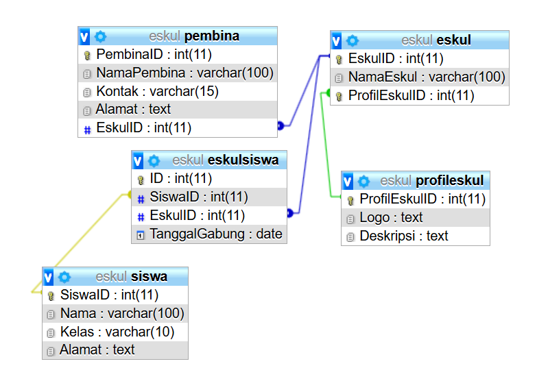

**ERD Hasil Revisi:**
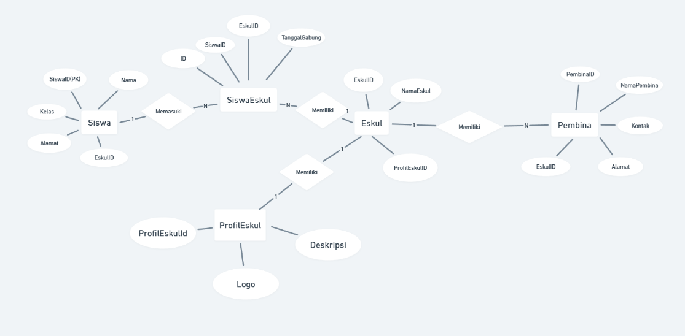

Pada revisi kali ini kami akan memodifikasi tabel yang kami miliki beserta relasinya agar sesuai dengan tujuan revisi dan kami juga telah menyesuaikan berbagai kolom dibeberapa tabel agar lebih kompatibel dengan tujuan utama pembuatan database ini. **Penjelasan revisinya sebagai berikut:**
# Revisi 1
Pada revisi pertama, kami telah mengubah struktur dan kardinalitas pada tabel **eskul** dan tabel **pembina**, dimana sebelum direvisi, tabel **eskul** memiliki kolom **PembinaID** yang nantinya akan berelasi dengan kolom **PembinaID** di tabel **pembina**. Setelah direvisi, kolom **PembinaID** pada tabel **eskul** dihapus, sebaliknya pada tabel **pembina** ditambahkan kolom **EskulID** yang nantinya kolom tersebut akan berelasi dengan kolom **EskulID** di tabel **eskul**. Revisi ini dilakukan untuk diseusaikan dengan data terbaru bahwa **satu eskul dapat dibimbing oleh dua pembina, namun satu pembina tidak dapat membimbing dua eskul sekaligus.** Nantinya, kardinalitas yang awalnya **N-1** berubah menjadi **1-N**.

**Tabel Pembina:**
```sql
CREATE TABLE Pembina (
    PembinaID INT PRIMARY KEY AUTO_INCREMENT,
    NamaPembina VARCHAR(100),
    Kontak VARCHAR(15),
    Alamat TEXT,
    EskulID INT,
    CONSTRAINT fk_Pembina_Eskul FOREIGN KEY (EskulID) REFERENCES Eskul(EskulID) ON DELETE SET NULL
);
```
Hasil:
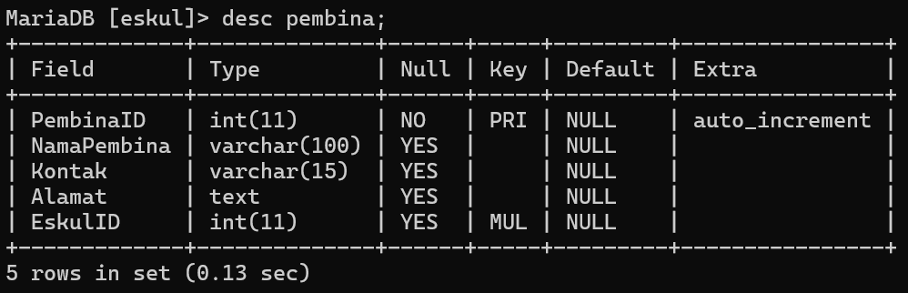

Isi Data:
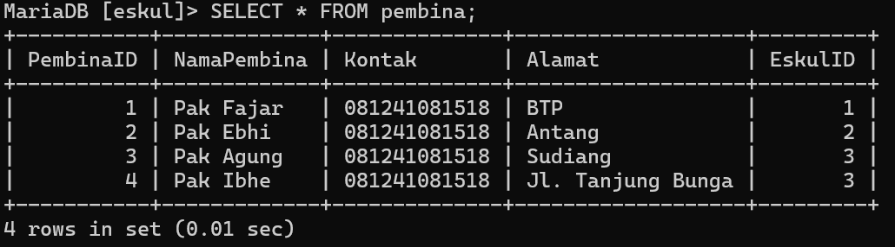

**Tabel Eskul**
```sql
CREATE TABLE Eskul (
EskulID INT PRIMARY KEY AUTO_INCREMENT,
NamaEskul VARCHAR(100),
ProfilEskulID INT UNIQUE,
CONSTRAINT fk_Eskul_ProfilEskul FOREIGN KEY (ProfilEskulID) REFERENCES ProfilEskul(ProfilEskulID) ON DELETE CASCADE
);
```
Hasil:


Isi Data:
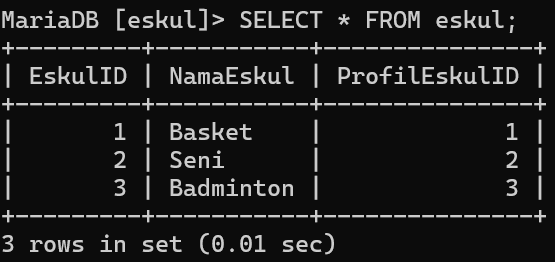

# Revisi 2
Pada revisi kedua adalah Forgine Key Eskul dipindahkan ke ProfilEskul. Berdasarkan revisi ini, maka kolom relasi yang sebelumnya berada di tabel **profil eskul** dipindahkan ke tabel **eskul**. Berikut hasil revisinya:

**Tabel profileskul**:
```sql
CREATE TABLE ProfilEskul (
    ProfilEskulID INT PRIMARY KEY AUTO_INCREMENT,
    Logo TEXT,
    Deskripsi TEXT
);
```
Hasil:
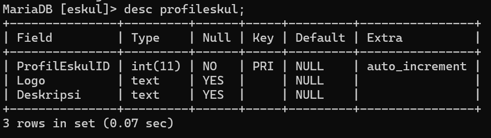

Isi Data:


Pada tabel Eskul terdapat kolom **ProfilEskulID** yang akan menjadi forgine key agar data tabel **eskul** dapat tehubung dengan data di tabel **ProfilEskulID**.

**Tabel Eskul:**


# Revisi 3
Pada revisi selanjutnya, kami akan membuatkan sebuah pivot tabel untuk relasi antara tabel **siswa** dengan tabel **eskul**. Seperti yang diketahui, kardinalitas antara tabel **siswa** dengan tabel **eskul** adalah **Many to Many**. Sehingga agar memudahkan sistem kerja database, maka harus dibuatkan pivot tabel diantara kedua tabel tadi, sehingga nantinya kardinalitas akan berubah dari **many to many** menjadi **many to one** atau sebaliknya. Berikut tabel pivot yang telah kami buat dan kami beri nama **EskulSiswa**

**Tabel EskulSiswa:**
```sql
CREATE TABLE EskulSiswa (
    ID INT PRIMARY KEY AUTO_INCREMENT,
    SiswaID INT,
    EskulID INT,
    TanggalGabung DATE,
    CONSTRAINT fk_EskulSiswa_SiswaID FOREIGN KEY (SiswaID) REFERENCES Siswa(SiswaID) ON DELETE CASCADE,
    CONSTRAINT fk_EskulSiswa_EskulID FOREIGN KEY (EskulID) REFERENCES Eskul(EskulID) ON DELETE CASCADE
);
```
Hasil:
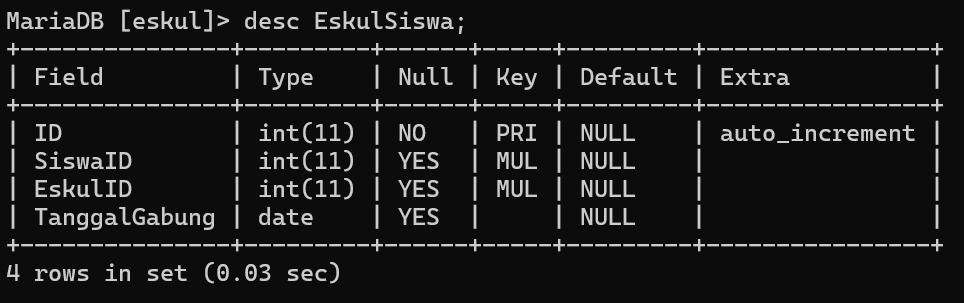

Isi Data:
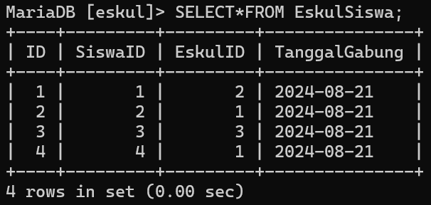

Penjelasan:
**1. CREATE TABLE EskulSiswa**
- **Fungsi**:
    - Membuat tabel `EskulSiswa` yang digunakan sebagai tabel pivot untuk mengelola relasi antara tabel **Siswa** dan **Eskul**.
- **Konteks**:
    - Tabel ini mendukung relasi **N:1** antara **Siswa** dan **Eskul**, artinya:
        - Satu siswa dapat terdaftar di satu eskul.
        - Eskul dapat memiliki banyak siswa.

**2. ID INT PRIMARY KEY AUTO_INCREMENT**
- **Kolom**: `ID`
    - Tipe data: **INT** (Integer), digunakan untuk menyimpan ID unik setiap entri di tabel.
    - **PRIMARY KEY**: Menandakan bahwa kolom ini adalah **Primary Key**, sehingga nilainya harus unik dan tidak boleh bernilai `NULL`.
    - **AUTO_INCREMENT**: Nilai akan otomatis bertambah setiap kali data baru dimasukkan.

**3. SiswaID INT**
- **Kolom**: `SiswaID`
    - Tipe data: **INT** (Integer), digunakan untuk menyimpan ID siswa yang terdaftar di tabel `Siswa`.
    - **Relasi**:
        - Kolom ini menjadi **foreign key** yang merujuk ke kolom **SiswaID** di tabel **Siswa**.
        - Menghubungkan data siswa dengan eskul yang diikuti.

**4. EskulID INT**
- **Kolom**: `EskulID`
    - Tipe data: **INT** (Integer), digunakan untuk menyimpan ID eskul yang ada di tabel `Eskul`.
    - **Relasi**:
        - Kolom ini menjadi **foreign key** yang merujuk ke kolom **EskulID** di tabel **Eskul**.
        - Menghubungkan data eskul yang diikuti siswa.

**5. TanggalGabung DATE**
- **Kolom**: `TanggalGabung`
    - Tipe data: **DATE**, digunakan untuk menyimpan informasi tentang tanggal siswa bergabung ke eskul tertentu.
    - Contoh Format: `2024-08-21`.

**6. CONSTRAINT fk_EskulSiswa_SiswaID FOREIGN KEY (SiswaID)**
- **Fungsi**:
    - Membuat **foreign key** pada kolom `SiswaID` untuk merujuk ke kolom `SiswaID` di tabel **Siswa**.
- **ON DELETE CASCADE**:
    - Jika data siswa dihapus dari tabel **Siswa**, semua data yang terkait di tabel **EskulSiswa** juga akan dihapus.

**7. CONSTRAINT fk_EskulSiswa_EskulID FOREIGN KEY (EskulID)**
- **Fungsi**:
    - Membuat **foreign key** pada kolom `EskulID` untuk merujuk ke kolom `EskulID` di tabel **Eskul**.
- **ON DELETE CASCADE**:
    - Jika data eskul dihapus dari tabel **Eskul**, semua data yang terkait di tabel **EskulSiswa** juga akan dihapus.

Berikut tabel **siswa** yang telah kami sesuaikan untuk tabel pivot yang telah kami buat:

**Tabel Siswa:**
```sql
CREATE TABLE Siswa (
    SiswaID INT PRIMARY KEY AUTO_INCREMENT,
    Nama VARCHAR(100),
    Kelas VARCHAR(10),
    Alamat TEXT
);
```
Hasil:
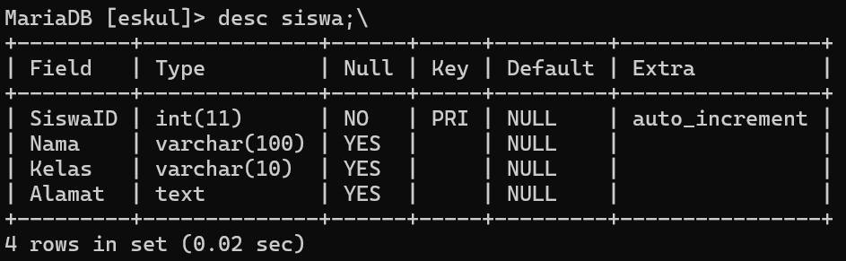

Isi Data:
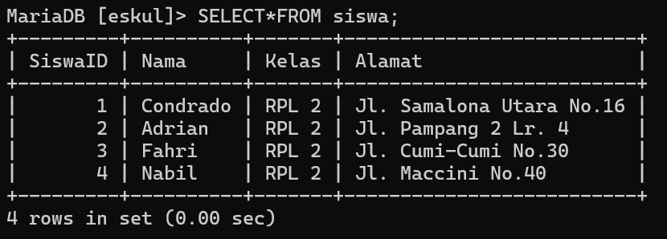

Pada tabel Pivotnya dijelaskan bahwa beberapa siswa memasuki beberapa eskul diinisialisasikan dengan Id siswa dan Id eskul masing masing.
# Revisi 4
Revisi selanjutnya adalah mengubah Query kedua. Seperti yang diketahui pada tabel **pembina** dan tabel **eskul** telah mengalami perubahan baik untuk perubahan kolom ataupun perubahan kardinalitas. PErubahan terjadi untuk mendukung kesesuaian data pada penerapannya dan untuk mendukung perubahan kardinalitas yang telah terjadi. Berikut Revisi Query kedua beserta penjelasannya:

**Query 2: Menampilkan Nama Eskul Beserta jumlah Pembinanya**
```sql
SELECT e.NamaEskul AS Nama_Eskul, COUNT(p.PembinaID) AS Jumlah_Pembina
FROM Eskul e
LEFT JOIN Pembina p ON e.EskulID = p.EskulID
GROUP BY e.EskulID
HAVING COUNT(p.PembinaID) >= 1;
```
Hasil:
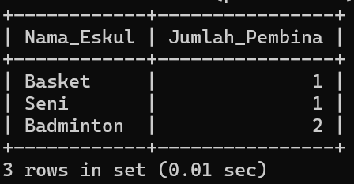

Penjelasan:
**1. SELECT e.NamaEskul AS Nama_Eskul, COUNT(p.PembinaID) AS Jumlah_Pembina**
- **`e.NamaEskul`**:
    - Memilih nama eskul dari tabel **Eskul**.
    - Diberi alias **`Nama_Eskul`** untuk mempermudah pembacaan hasil query.
- **`COUNT(p.PembinaID)`**:
    - Menggunakan fungsi agregat **COUNT** untuk menghitung jumlah pembina (`PembinaID`) yang terkait dengan setiap eskul.
    - Hasilnya diberi alias **`Jumlah_Pembina`**.
**2. FROM Eskul e**
- Menentukan tabel **Eskul** sebagai tabel utama dalam query.
- Tabel ini digunakan sebagai dasar untuk mengelompokkan data eskul.

**3. LEFT JOIN Pembina p ON e.EskulID = p.EskulID**
- **`LEFT JOIN`**:
    - Menghubungkan tabel **Eskul** dengan tabel **Pembina** berdasarkan kolom **EskulID**.
    - Menggunakan **LEFT JOIN** untuk memastikan semua eskul tetap muncul, bahkan jika tidak memiliki pembina.

**4. GROUP BY e.EskulID**
- Mengelompokkan hasil berdasarkan **EskulID**, sehingga fungsi agregat **COUNT** dapat menghitung jumlah pembina untuk setiap eskul.

**5. HAVING COUNT(p.PembinaID) >= 1**
- **`HAVING`**:
    - Digunakan untuk memfilter hasil setelah data dikelompokkan.
    - Kondisi **`COUNT(p.PembinaID) >= 1`** memastikan hanya eskul dengan minimal satu pembina yang ditampilkan.
