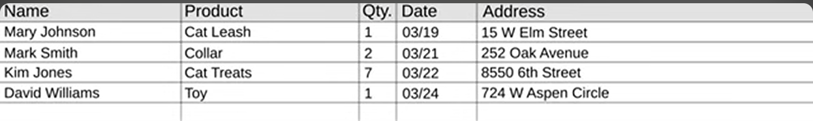
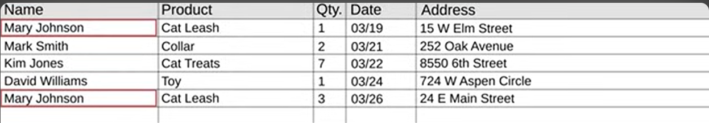
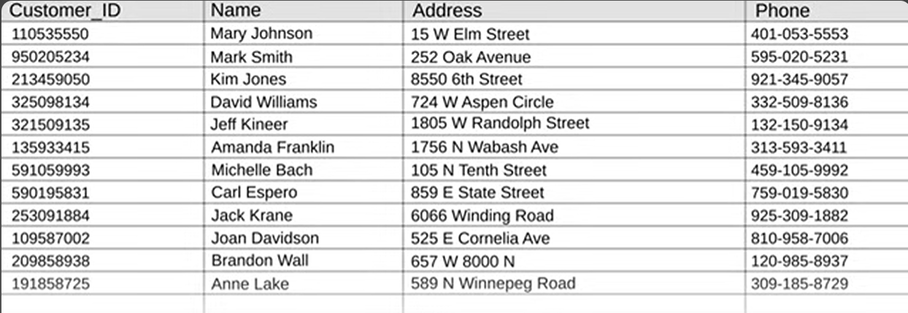
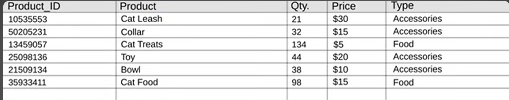
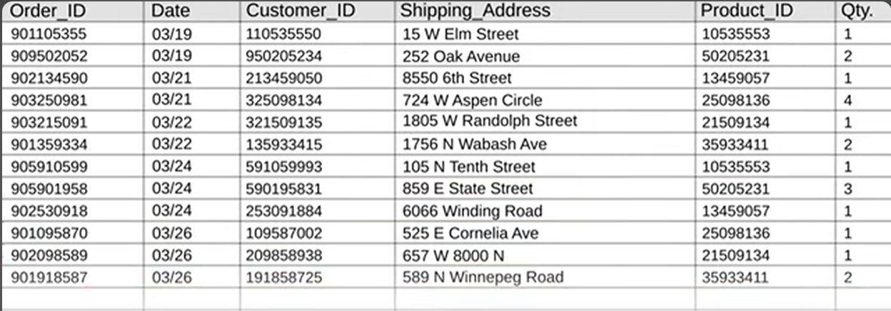

Di dalam Database, kita menemukan sebuah konsep bernama *Entity Relationship Diagram* atau disingkat ERD. Konsep ini adalah bagaimana cara merelasikan atau menghubungkan tabel-tabel yang berbeda namun memiliki cara kerja yang sama untuk mencapai tujuan bersama.

refrensi video: https://youtu.be/wR0jg0eQsZA?si=qBbmu1J61YIO9Dro

Berdasarkan video kami akan menguraikan hal-hal berikut ini:
1. Permasalahan
2. Solusi
3. Konsep ERD
4. 3 bentuk pernyataan dalam yang ada di dalam video
# Permasalahan

Pada video ini, study kasus yang digunakan adalah permasalahan pendataan pelanggan beserta orderannya di sebuah toko hewan online. Permasalahan pada study kasus ini yang mungkin juga dialami secara umum adalah, mereka mendata orderan menggunakan sebuah *spreadsheet* dimana mereka secara monoton memasukan data-data orderan secara mengalir masuk dan berurut. Data akan terlihat seperti ini:

Namun masalah terjadi jika seorang pelanggan memesan 3 barang secara bersamaan dalam satu waktu, hal ini akan menimnbulkan informasi dan data yang berlebihan. Kita akan menginput orang yang sama namun dengan produk yang berbeda yang sangat tidak efisien dan menimbulkan kebingunang. Belum lagi jika seandainya dalam contoh study kasus ini, pelanggan yang memesan ingin agar produk kedua mereka dikirimkan ke alamat yang berbeda dengan orderan pertama mereka. Ini akan menimbulkan kebingungan dan organisir data pelanggan yang tidak baik sehingga mengganggu kinerja dan pelayanan toko kita. Hal ini juga akan menjadi membingungkan jika seandainya ada 2 pelanggan berbeda namun memiliki nama yang sama, kita akan menjadi bingung dan akan memunculkan kemungkinan kesalahan pengiriman.

# SOLUSI
Untuk mengatasi masalah tersebut, mari kita gunakan konsep **Entity Relationship Diagram (ERD)** dalam manajemen basis data pendataan pelanggan toko kita. Dalam konteks study kasus kita, alih-alih menggunakan spreadsheet tunggal, mari kita membuat 3 tabel dan memisahkan antara tabel *customer*, tabel *product* dan tabel *orders*.  

tabel customer:

jadi kita tidak perlu lagi ada data pelanggan yang duplikat. Setiap pelanggan yang berbeda akan ditandai oleh Customer_ID yang berbeda. hal ini berlaku juga untuk tabel orders dan tabel product dimana product dan data order akan dibedakan dengan Product_ID dan order_ID

Tabel Producs:

Tabel Orders:

Dalam tabel orders, Customer_ID datanya diambil dari tabel Customers tadi, dan Product_ID diambil dari tabel Products. Manajemen relasi inilah yang disebut dengan **Entity Relationship Diagram (ERD)**

# Konsep ERD
**Entity Relationship Diagram (ERD)** adalah model visual yang digunakan untuk menggambarkan hubungan antara entitas dalam sebuah sistem database. Konsep dasar ERD mencakup:

1. **Entitas (Entities):** Objek nyata atau konsep yang merepresentasikan data, misalnya pelanggan, produk, atau pesanan.
    
2. **Atribut (Attributes):** Karakteristik atau informasi yang terkait dengan entitas, seperti nama pelanggan atau harga produk.
    
3. **Relasi (Relationships):** Hubungan antara entitas yang menggambarkan interaksi, misalnya hubungan antara pelanggan dan pesanan.
    
ERD membantu merancang struktur database yang efisien, menghindari duplikasi data, dan meningkatkan integritas data.

Dalam studi kasus toko hewan online, masalah yang dihadapi adalah redundansi data saat pelanggan memesan beberapa produk dalam satu waktu. Spreadsheet yang digunakan menyebabkan duplikasi data pelanggan yang sama, terutama saat mereka memesan lebih dari satu barang atau menginginkan pengiriman ke alamat berbeda. Hal ini tidak efisien dan membingungkan.

Solusi dengan ERD melibatkan pemisahan data ke dalam tiga tabel:

1. **Customers** - berisi informasi unik tentang pelanggan (Customer_ID).
2. **Products** - menyimpan data produk yang dijual (Product_ID).
3. **Orders** - menghubungkan pelanggan dan produk melalui relasi (Order_ID, Customer_ID, Product_ID).

Dengan pendekatan ini, data pelanggan, produk, dan pesanan dapat diatur lebih efisien, menghindari duplikasi, serta memudahkan dalam mengelola informasi yang kompleks, seperti pesanan yang berbeda namun dari pelanggan yang sama.Relasi antar entitas adalah satu-ke-banyak antara **Customers** dan **Orders**, serta banyak-ke-banyak antara **Products** dan **Orders**. Diagram ini membantu mengelola data dengan lebih efisien dan menghindari duplikasi.

# 3 Bentuk Pernyataan

- "Dengan tabel-tabel yang terpisah, meskipun terpisah, mereka memiliki hubungan satu sama lain, dan inilah yang membentuk sebuah database."
    
- "Sistem manajemen database biasanya tidak memberi opsi terbaik untuk memvisualisasikan koneksi tersebut, itulah mengapa kita menggunakan **Entity Relationship Diagram (ERD)**."
    
- "ERD adalah alat yang hebat untuk perencanaan ketika Anda membangun database dari awal, membantu Anda memetakan ide ke dalam diagram sebelum diterjemahkan menjadi kode."