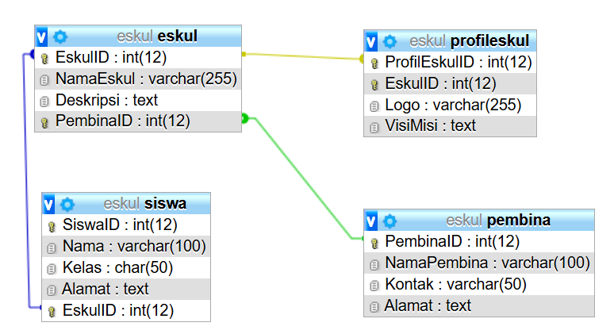
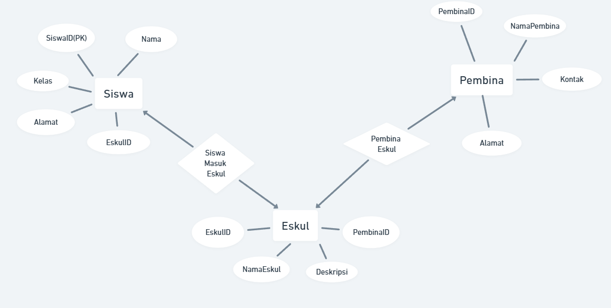

Pada praktik kali ini, kelompok kami mendapatkan tugas untuk membuat Diagram ERD dengan fokus Eskul pada SMK 7 Makassar. Berikut Tabel Eskul yang kami buat:

Berikut diagram ERD yang kami buat:

### Entitas dan Atribut

1. **Siswa**
   - Atribut:
     - SiswaID (PK)
     - Nama
     - Kelas
     - Alamat
     - EskulID (Primary Key pada Tabel Eskul)
   
2. **Eskul**
   - Atribut:
     - EskulID (PK)
     - NamaEskul
     - Deskripsi
     - PembinaID (FK, merujuk ke tabel Pembina)
   
3. **Pembina**
   - Atribut:
     - PembinaID (PK)
     - NamaPembina
     - Kontak
     - Alamat
### Hubungan dan Kardinalitas

1. **Siswa - Eskul**
   - Hubungan: *Mengikuti*
   - Kardinalitas: Banyak ke Banyak (Many-to-Many)
   - Penjelasan: Seorang siswa (Siswa) dapat mengikuti banyak kegiatan ekstrakurikuler (Eskul), dan setiap Eskul bisa diikuti oleh banyak siswa. 

2. **Eskul - Pembina**
   - Hubungan: *Dibimbing oleh*
   - Kardinalitas: Banyak ke Satu (Many-to-One)
   - Penjelasan: Setiap Eskul memiliki satu Pembina (pembimbing), tetapi seorang Pembina bisa membimbing banyak Eskul.
