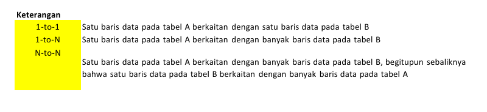
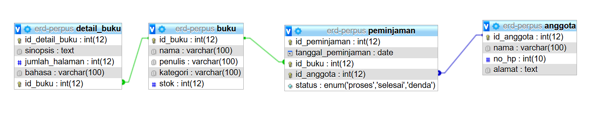
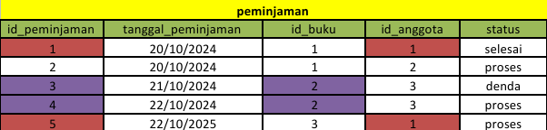
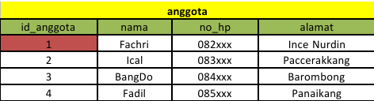

Pada tugas kali ini kami akan menjelaskan mngenai kardinalitas pada konsep ERD. Kardinalitas sendiri adalah sebuah konsep dalam ERD untuk menjelaskan hubungan/relasi antar tabel dalam satu database. Kardinalitas dalam ERD sendiri dikenal ada 3, yaitu *One to One, Many to One, dan Many to Many.*

Berikut ini keterangan tiap Kardinalitas:

1. **One-to-One (1-to-1)**: Hubungan di mana satu baris data pada tabel A berhubungan dengan satu baris data pada tabel B. Dalam konteks ini, setiap entitas di tabel A hanya memiliki satu pasangan terkait di tabel B, dan begitu pula sebaliknya.
    
2. **One-to-Many (1-to-N)**: Hubungan di mana satu baris data pada tabel A berhubungan dengan banyak baris data pada tabel B. Dengan kata lain, satu entitas di tabel A dapat memiliki beberapa pasangan terkait di tabel B, tetapi setiap entitas di tabel B hanya memiliki satu pasangan di tabel A.
    
3. **Many-to-Many (N-to-N)**: Hubungan di mana satu baris data pada tabel A berhubungan dengan banyak baris data pada tabel B, dan satu baris data pada tabel B juga berhubungan dengan banyak baris data pada tabel A. Dalam jenis hubungan ini, setiap entitas di kedua tabel dapat memiliki beberapa pasangan terkait di tabel lain.

**Contoh:**
Pada contoh kali ini kita akan menggunakan database perpustakaan, dimana kami akan mejelaskan hubungan One to Many dan Many to Many berdasarkan tabel tabel yang telah kami buat. Berikut tabel dari database perpustakaan:

**1. One To Many**

*Tabel Buku:*

*Tabel Peminjaman:*

One To Many dalam hal ini adalah hubungan di mana satu baris data pada tabel A berhubungan dengan banyak baris data pada tabel B. Pada contoh diatas, relasi yang memiliki hubungan one to many karena satu baris data buku dapat memiliki 2 atau lebih riwayat peminjaman. Pada contoh diatas, **buku id 2 dapat dipinjam sehingga memiliki lebih dari satu baris data pada tabel peminjaman**. Begitu juga yang terjadi antara tabel peminjaman dan tabel anggota, dimana **baris data pada tabel peminjaman memiliki lebih dari satu id_anggota yang diambil dari satu baris data tabel anggota.**

**2. Many To Many**

*Tabel buku:*

*Tabel Anggota*

Many to Many dalam konsep ERD adalah hubungan di mana satu baris data pada tabel A berhubungan dengan banyak baris data pada tabel B, dan satu baris data pada tabel B juga berhubungan dengan banyak baris data pada tabel A. Pada contoh diatas, satu buku dapat dipinjam oleh banyak anggota dan  satu anggota juga bisa meminjam banyak buku. Dalam hal ini, dapat dibuatkan pivot tabel sebagai penghubung sehingga nantinya kardinalisasi berubah menjadi one to many.

**3. **

**Penerapan pada ERD Database Eskul**

**Hubungan dan Kardinalitas:**
1. **Siswa - Eskul**
   - Kardinalitas: Banyak ke Banyak (Many-to-Many)
   - Penjelasan: Seorang siswa(Siswa) dapat memiliki lebih dari satu baris data yang berhubungan dengan tabel eskul, dimana baris data yang behubungan dengan eskul pun bisa lebih dari satu. Hal ini dikarenakan, **Siswa dapat memiliki lebih dari satu eskul.** Sebaiknya, hal ini di implementasikan dengan sebuah tabel pivot, misal dengan nama siswa_eskul.
   
   **Siswa Eskul:**

| SiswaID | EskulID | TanggalGabung |
| ------- | ------- | ------------- |
| 1       | 1       | 2024-01-15    |
| 2       | 2       | 2024-02-01    |
| 1       | 3       | 2024-03-10    |
| 3       | 1       | 2024-04-05    |
| 4       | 2       | 2024-04-20    |
Pada tabel Siswa Eskul diatas, siswa memiliki lebih dari satu baris data yaitu pada id_siswa 1 dan eskul juga memilik lebih dari satu baris data pada tabel pivot ini.

2. **Eskul - Pembina**
   - Kardinalitas: Banyak ke Satu (Many-to-One)
   - Penjelasan: Setiap Eskul memiliki satu Pembina (pembimbing), tetapi seorang Pembina bisa membimbing banyak Eskul. Oleh karena itu, baris data pembina pada tabel eskul dapat lebih dari satu, dan lebih dari satu baris data id_pembina pada tabel eskul berhubungan dengan satu baris data pada tabel pembina, yaitu pada id_pembina.

**tabel eskul**

| EskulID | NamaEskul | Deskripsi   | PembinaID |
| ------- | --------- | ----------- | --------- |
| 1       | Basket    | Lorem Ipsum | 1         |
| 2       | Futsal    | Lorem Ipsum | 2         |
| 3       | Seni      | Lorem Ipsum | 1         |

**Tabel Pembina**

| PembinaID | NamaPembina | Kontak | Alamat        |
| --------- | ----------- | ------ | ------------- |
| 1         | Ibrahim     | 081xxx | Tanjung Bunga |
| 2         | Fajar       | 082xxx | BTP           |
| 3         | Eby Gunawan | 083xxx | Antang        |
Pada Contoh di atas satu baris data di tabel pembina yaitu pembina dengan ID 1 memiliki 2 baris data di tabel eskul.

3. **eskul - profileskul**
   - Kardinalitas: Banyak ke Banyak (One-to-One) 
   - Penjelasan: Sebuah Eskul (Tabel Eskul) hanya memiliki lebih satu baris data yang berhubungan dengan tabel profileskul, dimana baris data yang behubungan dengan profileskul hanya dapat dihubungkan dengan satu baris data di tabel Eskul. Hal ini dikarenakan, **Sebuah eskul memiliki sebuah profil dan profil sebuah eskul tidak mungkin dimiliki oleh 2 eskul secara bersamaan** .

**tabel eskul**

| EskulID | NamaEskul | Deskripsi   | PembinaID |
| ------- | --------- | ----------- | --------- |
| 1       | Basket    | Lorem Ipsum | 1         |
| 2       | Futsal    | Lorem Ipsum | 2         |
| 3       | Seni      | Lorem Ipsum | 1         |

**Tabel profileskul

| ProfilEskulID | EskulID | Logo          | VisiMisi                 |
| ------------- | ------- | ------------- | ------------------------ |
| 1             | 1       | "Logo Basket" | Lorem Ipsum Dolor Siamet |
| 2             | 2       | "Logo Futsal" | Lorem Ipsum Dolor Siamet |
| 3             | 3       | "Logo Seni"   | Lorem Ipsum Dolor Siamet |
Pada Contoh di atas satu baris data di tabel Eskul misalnya Eskul Basket dengan ID 1 hanya bisa memiliki memiliki 1 baris data di tabel profileskul, yaitu profil basket.

**Tabel Penilaian**

| No  | Nama               | Nilai | Tugas                                                      |
| --- | ------------------ | ----- | ---------------------------------------------------------- |
| 1.  | Condrado           | 3     | Membuat Catatan                                            |
| 2.  | Adrian             | 3     | Membantu Membuat Catatan                                   |
| 3.  | Fahri Ilham        | 3     | Membantu membuat Catatan dan mengurus upload file ke drive |
| 4.  | Muh. Nabil Maulana | 2     | Penyemangat                                                |
| 5.  | Yeremia Tasik      | 2     | Penyemangat                                                |
