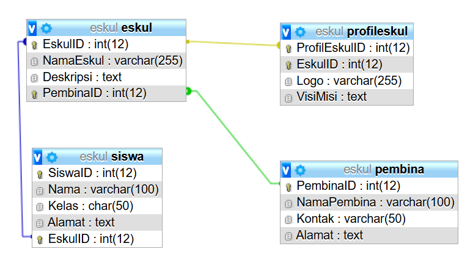

**Penerapan pada ERD Database Eskul**

**Hubungan dan Kardinalitas:**
1. **Siswa - Eskul**
   - Kardinalitas: Banyak ke Banyak (Many-to-Many)
   - Penjelasan: Seorang siswa(Siswa) dapat memiliki lebih dari satu baris data yang berhubungan dengan tabel eskul, dimana baris data yang behubungan dengan eskul pun bisa lebih dari satu. Hal ini dikarenakan, **Siswa dapat memiliki lebih dari satu eskul.** Sebaiknya, hal ini di implementasikan dengan sebuah tabel pivot, misal dengan nama siswa_eskul.
   
   **Siswa Eskul:**

| SiswaID | EskulID | TanggalGabung |
| ------- | ------- | ------------- |
| 1       | 1       | 2024-01-15    |
| 2       | 2       | 2024-02-01    |
| 1       | 3       | 2024-03-10    |
| 3       | 1       | 2024-04-05    |
| 4       | 2       | 2024-04-20    |
Pada tabel Siswa Eskul diatas, siswa memiliki lebih dari satu baris data yaitu pada id_siswa 1 dan eskul juga memilik lebih dari satu baris data pada tabel pivot ini.

2. **Eskul - Pembina**
   - Kardinalitas: Banyak ke Satu (Many-to-One)
   - Penjelasan: Setiap Eskul memiliki satu Pembina (pembimbing), tetapi seorang Pembina bisa membimbing banyak Eskul. Oleh karena itu, baris data pembina pada tabel eskul dapat lebih dari satu, dan lebih dari satu baris data id_pembina pada tabel eskul berhubungan dengan satu baris data pada tabel pembina, yaitu pada id_pembina.

**tabel eskul**

| EskulID | NamaEskul | Deskripsi   | PembinaID |
| ------- | --------- | ----------- | --------- |
| 1       | Basket    | Lorem Ipsum | 1         |
| 2       | Futsal    | Lorem Ipsum | 2         |
| 3       | Seni      | Lorem Ipsum | 1         |

**Tabel Pembina**

| PembinaID | NamaPembina | Kontak | Alamat        |
| --------- | ----------- | ------ | ------------- |
| 1         | Ibrahim     | 081xxx | Tanjung Bunga |
| 2         | Fajar       | 082xxx | BTP           |
| 3         | Eby Gunawan | 083xxx | Antang        |
Pada Contoh di atas satu baris data di tabel pembina yaitu pembina dengan ID 1 memiliki 2 baris data di tabel eskul.

3. **eskul - profileskul**
   - Kardinalitas: Banyak ke Banyak (One-to-One) 
   - Penjelasan: Sebuah Eskul (Tabel Eskul) hanya memiliki lebih satu baris data yang berhubungan dengan tabel profileskul, dimana baris data yang behubungan dengan profileskul hanya dapat dihubungkan dengan satu baris data di tabel Eskul. Hal ini dikarenakan, **Sebuah eskul memiliki sebuah profil dan profil sebuah eskul tidak mungkin dimiliki oleh 2 eskul secara bersamaan** .

**tabel eskul**

| EskulID | NamaEskul | Deskripsi   | PembinaID |
| ------- | --------- | ----------- | --------- |
| 1       | Basket    | Lorem Ipsum | 1         |
| 2       | Futsal    | Lorem Ipsum | 2         |
| 3       | Seni      | Lorem Ipsum | 1         |

**Tabel profileskul

| ProfilEskulID | EskulID | Logo          | VisiMisi                 |
| ------------- | ------- | ------------- | ------------------------ |
| 1             | 1       | "Logo Basket" | Lorem Ipsum Dolor Siamet |
| 2             | 2       | "Logo Futsal" | Lorem Ipsum Dolor Siamet |
| 3             | 3       | "Logo Seni"   | Lorem Ipsum Dolor Siamet |
Pada Contoh di atas satu baris data di tabel Eskul misalnya Eskul Basket dengan ID 1 hanya bisa memiliki memiliki 1 baris data di tabel profileskul, yaitu profil basket.

**Tabel Penilaian**

| No  | Nama               | Nilai | Tugas                                                      |
| --- | ------------------ | ----- | ---------------------------------------------------------- |
| 1.  | Condrado           | 3     | Membuat Catatan                                            |
| 2.  | Adrian             | 3     | Membantu Membuat Catatan                                   |
| 3.  | Fahri Ilham        | 3     | Membantu membuat Catatan dan mengurus upload file ke drive |
| 4.  | Muh. Nabil Maulana | 2     | Penyemangat                                                |
| 5.  | Yeremia Tasik      | 3     | Membantu Mencari catatan                                   |
|     |                    |       |                                                            |
