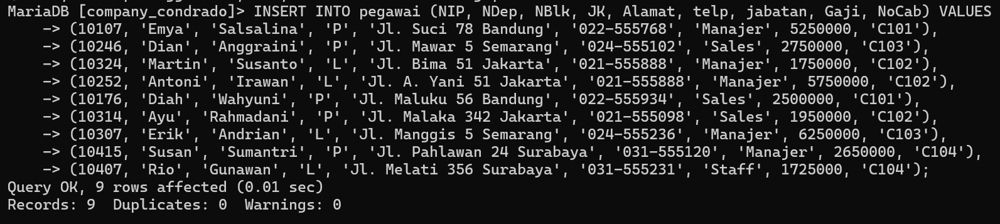
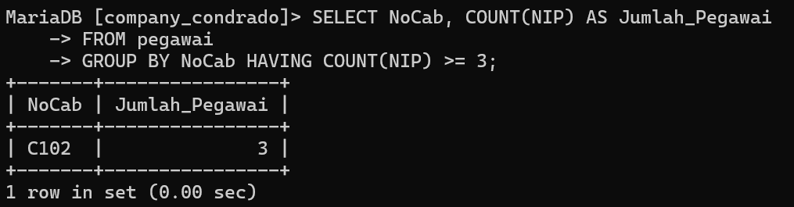

# GROUP BY DAN HAVING COUNT
`GROUP BY` dan `HAVING` adalah dua klausa yang sering digunakan bersama dalam SQL untuk mengelompokkan data dan kemudian memfilter hasil berdasarkan kondisi tertentu, terutama ketika menggunakan fungsi agregat seperti `COUNT`.

Pada materi sebelumnya kita telah melakukan pembuatan tabel pegawai dengan data sebagai berikut:



Sekarang kita akan mencoba menggunakan klausa Group By dan Having berdasarkan data tabel pegawai tersebut. Berikut contohnya:

Query:
```sql
SELECT NoCab, COUNT(NIP) AS Jumlah_Pegawai
FROM pegawai
GROUP BY NoCab HAVING COUNT(NIP) >= 3;
```
Hasil:


Penjelasan:
- **`SELECT NoCab, COUNT(NIP) AS Jumlah_Pegawai`**:
    - **`SELECT`**: Digunakan untuk memilih kolom yang ingin ditampilkan dalam hasil query.
    - **`NoCab`**: Kolom yang menunjukkan kode cabang, yang akan ditampilkan dalam hasil.
    - **`COUNT(NIP) AS Jumlah_Pegawai`**: Fungsi `COUNT(NIP)` menghitung jumlah baris di mana kolom `NIP` tidak bernilai `NULL` dalam setiap grup `NoCab`. Hasilnya diberi alias sebagai `Jumlah_Pegawai`, yang berarti jumlah pegawai di masing-masing cabang.
- **`FROM pegawai`**:
    - **`FROM`**: Menentukan tabel dari mana data akan diambil. Dalam hal ini, data diambil dari tabel `pegawai`.
- **`GROUP BY NoCab`**:
    - **`GROUP BY`**: Mengelompokkan data berdasarkan nilai `NoCab`, sehingga setiap kelompok terdiri dari semua baris yang memiliki nilai `NoCab` yang sama.
    - Setelah data dikelompokkan, fungsi `COUNT(NIP)` akan menghitung jumlah pegawai (`NIP`) di setiap kelompok `NoCab`.
- **`HAVING COUNT(NIP) >= 3`**:
    - **`HAVING`**: Digunakan untuk memfilter hasil setelah data dikelompokkan.
    - **`COUNT(NIP) >= 3`**: Kondisi ini memfilter kelompok-kelompok yang telah dibentuk oleh `GROUP BY` sehingga hanya kelompok yang memiliki `COUNT(NIP)` (jumlah pegawai) lebih besar atau sama dengan 3 yang akan ditampilkan dalam hasil akhir.