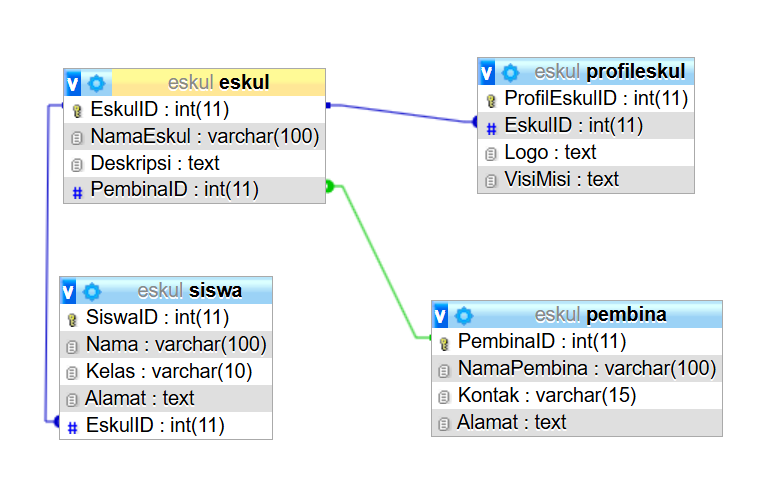

# SOAL 1
## Struktur ERD dan Database

**Database:**


**Struktur ERD:**
.jpg)

Untuk database di kelompok kami yaitu merancang database dan erd tentang eskul sekolah. di database ini terdiri dari 4 tabel yaitu tabel "eskul", tabel "profileskul", tabel "siswa", dan tabel "pembina". 

**Hubungan dan Kardinalitas:**
1. **Siswa - Eskul**
   - Kardinalitas: Banyak ke Banyak (Many-to-Many)
   - Penjelasan: Seorang siswa(Siswa) dapat memiliki lebih dari satu baris data yang berhubungan dengan tabel eskul, dimana baris data yang behubungan dengan eskul pun bisa lebih dari satu. Hal ini dikarenakan, **Siswa dapat memiliki lebih dari satu eskul.** Sebaiknya, hal ini di implementasikan dengan sebuah tabel pivot, misal dengan nama siswa_eskul.

2. **Eskul - Pembina**
   - Kardinalitas: Banyak ke Satu (Many-to-One)
   - Penjelasan: Setiap Eskul memiliki satu Pembina (pembimbing), tetapi seorang Pembina bisa membimbing banyak Eskul. Oleh karena itu, baris data pembina pada tabel eskul dapat lebih dari satu, dan lebih dari satu baris data id_pembina pada tabel eskul berhubungan dengan satu baris data pada tabel pembina, yaitu pada id_pembina.

3. **eskul - profileskul**
   - Kardinalitas: Banyak ke Banyak (One-to-One) 
   - Penjelasan: Sebuah Eskul (Tabel Eskul) hanya memiliki lebih satu baris data yang berhubungan dengan tabel profileskul, dimana baris data yang behubungan dengan profileskul hanya dapat dihubungkan dengan satu baris data di tabel Eskul. Hal ini dikarenakan, **Sebuah eskul memiliki sebuah profil dan profil sebuah eskul tidak mungkin dimiliki oleh 2 eskul secara bersamaan** .

Berikut penjelasan dari masing-masing tabel:
### Tabel Eskul

**Struktur Query:**
```sql
CREATE TABLE Eskul ( 
EskulID INT PRIMARY KEY, 
NamaEskul VARCHAR(100), 
Deskripsi TEXT, 
PembinaID INT, 
CONSTRAINT fk_PembinaID FOREIGN KEY (PembinaID) REFERENCES Pembina(PembinaID) ON DELETE SET NULL );
```
hasil:
.jpg)

Tabel eskul adalah tabel utama yang berperan penting dalam database ini. Tabel ini berisi macam-macam eskul yang ada pada sekolah. Tabel ini terdiri dari 4 kolom yaitu kolom "EskulID", kolom "NamaEskul", kolom "Deskripsi", dan kolom "PembinaID". Untuk Forgine keynya, tabel ini berelasi dengan tabel "pembina", dimana tiap eskul memiliki pembina dan diinisialisasikan dengan "pembinaID" yang diambil dari tabel pembina.

**Penjelasan Query**:
**1. CREATE TABLE Eskul**
- **Fungsi**: Membuat tabel baru bernama `Eskul` yang akan digunakan untuk menyimpan data ekstrakurikuler.
- **Kolom-kolom yang didefinisikan dalam tabel**: `EskulID`, `NamaEskul`, `Deskripsi`, dan `PembinaID`.

**2. EskulID INT PRIMARY KEY**
- **Kolom**: `EskulID`
    - Tipe data: **INT** (Integer), digunakan untuk menyimpan ID unik untuk setiap ekstrakurikuler.
    - **PRIMARY KEY**: Menandakan bahwa kolom ini adalah **Primary Key**, sehingga nilainya harus unik dan tidak boleh `NULL`.

**3. NamaEskul VARCHAR(100)**
- **Kolom**: `NamaEskul`
    - Tipe data: **VARCHAR(100)**, digunakan untuk menyimpan nama ekstrakurikuler dalam bentuk teks dengan panjang maksimum 100 karakter.
    - Contoh: "Basket", "Seni", "Pramuka".

**4. Deskripsi TEXT**
- **Kolom**: `Deskripsi`
    - Tipe data: **TEXT**, digunakan untuk menyimpan deskripsi atau informasi tambahan tentang ekstrakurikuler.
    - Tidak ada batasan panjang tertentu, tetapi disarankan tidak terlalu panjang.

 **5. PembinaID INT**
- **Kolom**: `PembinaID`
    - Tipe data: **INT** (Integer), digunakan untuk menyimpan ID pembina.
    - **Relasi**: Kolom ini adalah **Foreign Key** yang merujuk ke kolom `PembinaID` di tabel **Pembina**.

**6. CONSTRAINT fk_PembinaID**
- **Fungsi**: Membuat constraint atau batasan pada kolom `PembinaID` untuk menjadikannya **Foreign Key**.
- **Nama Constraint**: `fk_PembinaID`.
- **Foreign Key**:
    - Kolom `PembinaID` di tabel `Eskul` merujuk ke kolom `PembinaID` di tabel `Pembina`.
    - Relasi ini menunjukkan bahwa setiap ekstrakurikuler memiliki pembina yang terkait di tabel **Pembina**.

**7. ON DELETE SET NULL**
- **Fungsi**: Menentukan perilaku ketika data di tabel **Pembina** dihapus.
- **`SET NULL`**: Jika data pembina yang terkait dihapus dari tabel **Pembina**, nilai `PembinaID` di tabel **Eskul** akan diatur menjadi `NULL`.
    - **Alasan**: Ini memastikan data ekstrakurikuler tetap ada meskipun pembina yang terkait dihapus.

**Isi Data Tabel Eskul:**
.jpg)
### Tabel Pembina

**Struktur Query:**
```sql
CREATE TABLE Pembina (
    PembinaID INT PRIMARY KEY,
    NamaPembina VARCHAR(100),
    Kontak VARCHAR(15),
    Alamat TEXT
);
```
**Hasil:**
.jpg)
Tabel pembina adalah tabel yang berisi para pembina yang membawahi eskul. Tabel ini terdiri dari 4 kolom yaitu kolom "PembinaID", kolom "NamaPembina", kolom "Kontak", dan kolom "Alamat".

**Penjelasan Query:**

**1. CREATE TABLE Pembina**
- **Fungsi**: Membuat tabel baru bernama `Pembina` yang akan digunakan untuk menyimpan data pembina ekstrakurikuler.
- **Kolom-kolom yang didefinisikan dalam tabel**: `PembinaID`, `NamaPembina`, `Kontak`, dan `Alamat`.

**2. PembinaID INT PRIMARY KEY**
- **Kolom**: `PembinaID`
    - Tipe data: **INT** (Integer), digunakan untuk menyimpan ID unik untuk setiap pembina.
    - **PRIMARY KEY**: Menandakan bahwa kolom ini adalah **Primary Key**, sehingga nilainya harus unik dan tidak boleh bernilai `NULL`.
    - Contoh: 1, 2, 3, ...

**3. NamaPembina VARCHAR(100)**
- **Kolom**: `NamaPembina`
    - Tipe data: **VARCHAR(100)**, digunakan untuk menyimpan nama pembina dengan panjang maksimum 100 karakter.
    - Contoh: "Pak Fajar", "Bu Hasnidar".

**4. Kontak VARCHAR(15)**
- **Kolom**: `Kontak`
    - Tipe data: **VARCHAR(15)**, digunakan untuk menyimpan nomor kontak pembina dengan panjang maksimum 15 karakter.
    - Contoh: "081234567890".
    - Batasan panjang ini cukup untuk menyimpan format nomor telepon nasional atau internasional sederhana.

**5. Alamat TEXT**
- **Kolom**: `Alamat`
    - Tipe data: **TEXT**, digunakan untuk menyimpan alamat pembina dalam bentuk teks.
    - Tidak memiliki batasan panjang tertentu.
    - Contoh: "Jl. Samalona Utara No. 16", "Jl. Sultan Alauddin No. 20".

**Isi Data tabel Pembina**
.jpg)
### Tabel Siswa

**Struktur Query:**
```sql
CREATE TABLE Siswa ( 
SiswaID INT PRIMARY KEY, 
Nama VARCHAR(100), Kelas VARCHAR(10), 
Alamat TEXT, EskulID INT, 
CONSTRAINT fk_EskulID FOREIGN KEY (EskulID) REFERENCES Eskul(EskulID) ON DELETE SET NULL );
```
**Hasil:**
.jpg)
Tabel siswa adalah tabel yang berisi para siswa yang tergabung di dalam eskul. Tabel ini terdiri dari 5 kolom yaitu kolom "SiswaID", kolom "Nama", kolom "Kelas", kolom "Alamat", dan kolom "EskulID".

**Penjelasan Query:**

**1. CREATE TABLE Siswa**
- **Fungsi**: Membuat tabel baru bernama `Siswa` yang akan digunakan untuk menyimpan data siswa yang terdaftar dalam ekstrakurikuler.
- **Kolom-kolom yang didefinisikan dalam tabel**: `SiswaID`, `Nama`, `Kelas`, `Alamat`, dan `EskulID`.

**2. SiswaID INT PRIMARY KEY**
- **Kolom**: `SiswaID`
    - Tipe data: **INT** (Integer), digunakan untuk menyimpan ID unik untuk setiap siswa.
    - **PRIMARY KEY**: Menandakan bahwa kolom ini adalah **Primary Key**, sehingga nilainya harus unik dan tidak boleh bernilai `NULL`.
    - Contoh: 1, 2, 3, ...

**3. Nama VARCHAR(100)**
- **Kolom**: `Nama`
    - Tipe data: **VARCHAR(100)**, digunakan untuk menyimpan nama siswa dengan panjang maksimum 100 karakter.
    - Contoh: "Andi", "Budi", "Citra".

 **4. Kelas VARCHAR(10)**
- **Kolom**: `Kelas`
    - Tipe data: **VARCHAR(10)**, digunakan untuk menyimpan informasi kelas siswa dengan panjang maksimum 10 karakter.
    - Contoh: "10-A", "11-B".

**5. Alamat TEXT**
- **Kolom**: `Alamat`
    - Tipe data: **TEXT**, digunakan untuk menyimpan alamat siswa dalam bentuk teks panjang.
    - Contoh: "Jl. Samalona Utara No. 16", "Jl. Sultan Alauddin No. 20".

 **6. EskulID INT**
- **Kolom**: `EskulID`
    - Tipe data: **INT** (Integer), digunakan untuk menyimpan ID ekstrakurikuler (Foreign Key) yang diikuti siswa.
    - **Relasi**: Kolom ini menjadi **Foreign Key** yang merujuk ke kolom `EskulID` di tabel **Eskul**.
    - Contoh: Jika siswa mengikuti ekstrakurikuler **Basket**, maka `EskulID` akan mengacu pada **EskulID** dari ekstrakurikuler Basket di tabel **Eskul**.

 **7. CONSTRAINT fk_EskulID FOREIGN KEY**
- **Fungsi**: Membuat constraint (batasan) pada kolom `EskulID` untuk menjadikannya **Foreign Key**.
- **Nama Constraint**: `fk_EskulID`.
- **Foreign Key**:
    - Kolom `EskulID` di tabel **Siswa** merujuk ke kolom `EskulID` di tabel **Eskul`.
    - Relasi ini menunjukkan bahwa setiap siswa bisa mengikuti salah satu ekstrakurikuler yang ada di tabel **Eskul`.

**8. ON DELETE SET NULL**
- **Fungsi**: Menentukan perilaku ketika data di tabel **Eskul** yang dirujuk dihapus.
- **`SET NULL`**: Jika data di tabel **Eskul** dihapus, maka nilai `EskulID` di tabel **Siswa** akan diatur menjadi `NULL`.
    - **Alasan**: Ini memastikan bahwa data siswa tetap ada, meskipun data ekstrakurikuler yang mereka ikuti telah dihapus.

**Isi data tabel Siswa**
.jpg)
### Tabel ProfilEskul

**Struktur Query:**
```sql
CREATE TABLE ProfilEskul (
    ProfilEskulID INT PRIMARY KEY,
    EskulID INT,
    Logo TEXT,
    VisiMisi TEXT,
    CONSTRAINT fk_ProfilEskul_EskulID FOREIGN KEY (EskulID) REFERENCES Eskul(EskulID) ON DELETE CASCADE
);
```
**Hasil:**
.jpg)
Tabel profileskul adalah tabel yang berisi profil dari tiap eskul. Tabel ini terdiri dari 5 kolom yaitu kolom "ProfilEskulID", kolom "EskulID", kolom "Logo", dan kolom "VisiMisi".

**Penjelasan:**
**1. CREATE TABLE ProfilEskul**
- **Fungsi**: Membuat tabel baru bernama `ProfilEskul` yang akan digunakan untuk menyimpan informasi tambahan mengenai ekstrakurikuler (eskul), seperti logo dan visi-misi.
- **Kolom-kolom yang didefinisikan dalam tabel**: `ProfilEskulID`, `EskulID`, `Logo`, dan `VisiMisi`.

**2. ProfilEskulID INT PRIMARY KEY**
- **Kolom**: `ProfilEskulID`
    - Tipe data: **INT** (Integer), digunakan untuk menyimpan ID unik untuk setiap profil eskul.
    - **PRIMARY KEY**: Menandakan bahwa kolom ini adalah **Primary Key**, sehingga nilainya harus unik dan tidak boleh bernilai `NULL`.
    - Contoh: 1, 2, 3, ...

**3. EskulID INT**
- **Kolom**: `EskulID`
    - Tipe data: **INT** (Integer), digunakan untuk menyimpan ID eskul yang dihubungkan dengan tabel `Eskul`.
    - **Relasi**: Kolom ini menjadi **Foreign Key** yang merujuk ke kolom `EskulID` di tabel **Eskul`.
    - Contoh: Jika profil ini untuk eskul Basket, maka `EskulID` mengacu pada **EskulID** dari ekstrakurikuler Basket di tabel **Eskul`.

**4. Logo TEXT**
- **Kolom**: `Logo`
    - Tipe data: **TEXT**, digunakan untuk menyimpan informasi terkait lokasi file atau URL gambar logo eskul.
    - Contoh: "basket_logo.png", "https://example.com/seni_logo.jpg".

**5. VisiMisi TEXT**
- **Kolom**: `VisiMisi`
    - Tipe data: **TEXT**, digunakan untuk menyimpan visi dan misi dari setiap eskul.
    - Tidak ada batasan panjang tertentu.
    - Contoh: "Mengembangkan kreativitas seni siswa", "Melatih kemampuan kerja tim dan kepemimpinan".

**6. CONSTRAINT fk_ProfilEskul_EskulID FOREIGN KEY**
- **Fungsi**: Membuat constraint (batasan) pada kolom `EskulID` untuk menjadikannya **Foreign Key**.
- **Nama Constraint**: `fk_ProfilEskul_EskulID`.
- **Foreign Key**:
    - Kolom `EskulID` di tabel **ProfilEskul** merujuk ke kolom `EskulID` di tabel **Eskul`.
    - Relasi ini menunjukkan bahwa setiap profil hanya terkait dengan satu ekstrakurikuler.

**7. ON DELETE CASCADE**
- **Fungsi**: Menentukan perilaku ketika data di tabel **Eskul** yang dirujuk dihapus.
- **`CASCADE`**: Jika data di tabel **Eskul** dihapus, maka data yang terkait di tabel **ProfilEskul** juga akan dihapus secara otomatis.
    - **Alasan**: Hal ini memastikan bahwa tidak ada profil yang tertinggal di tabel **ProfilEskul** jika eskul yang bersangkutan sudah tidak ada.

**Isi Data tabel ProfilEskul:**
.jpg)
# Soal 2

Pada soal kedua yaitu tampilkan datanya secara kontekstual dengan menggunakan query relasi, group by, dan having secara bersamaan dalam satu query. Buatlah minimal sebanyak 2 contoh.
## Query 1: Menampilkan Ekstrakurikuler dengan Jumlah Siswa >= 2

**Struktur Query:**
```sql
SELECT e.NamaEskul AS Nama_Eskul, COUNT(s.SiswaID) AS Jumlah_Siswa
FROM Siswa s
JOIN Eskul e ON s.EskulID = e.EskulID
GROUP BY e.EskulID
HAVING COUNT(s.SiswaID) >= 2;
```
**Hasil:**
.jpg)

**Penjelasan:**
- Dari data di tabel **Siswa**, siswa terhubung dengan ekstrakurikuler:
    - **EskulID = 1 (Basket)**: Adrian dan Nabil → 2 siswa.
    - **EskulID = 2 (Seni)**: Condrado → 1 siswa.
    - **EskulID = 3 (Badminton)**: Fahri → 1 siswa.
- Hanya **Basket (EskulID = 1)** yang memiliki jumlah siswa **>= 2**.

**Analsis Struktur Query:**

**1. SELECT e.NamaEskul AS Nama_Eskul, COUNT(s.SiswaID) AS Jumlah_Siswa**
- **Fungsi**:
    - Memilih nama ekstrakurikuler dari tabel `Eskul` dan menghitung jumlah siswa yang terdaftar pada setiap eskul.
- **Komponen**:
    - **`e.NamaEskul`**: Memilih kolom `NamaEskul` dari tabel `Eskul` untuk mendapatkan nama ekstrakurikuler.
    - **`COUNT(s.SiswaID)`**: Fungsi agregat untuk menghitung jumlah siswa yang terhubung ke setiap eskul berdasarkan kolom `SiswaID`.
    - **`AS`**: Memberi alias pada kolom hasil, sehingga kolom `NamaEskul` diberi nama `Nama_Eskul`, dan hasil `COUNT(s.SiswaID)` diberi nama `Jumlah_Siswa`.

**2. FROM Siswa s**
- **Fungsi**:
    - Menentukan tabel sumber data, yaitu tabel `Siswa`.
- **Alias**:
    - Tabel `Siswa` diberi alias `s` untuk mempermudah penulisan dalam query.

**3. JOIN Eskul e ON s.EskulID = e.EskulID**
- **Fungsi**:
    - Menggabungkan tabel `Siswa` dengan tabel `Eskul` menggunakan **INNER JOIN**.
    - Kondisi penggabungan adalah **`s.EskulID = e.EskulID`**, yang memastikan bahwa siswa hanya dihitung jika mereka terhubung ke sebuah eskul di tabel `Eskul`.

**4. GROUP BY e.EskulID**
- **Fungsi**:
    - Mengelompokkan data berdasarkan kolom `EskulID` dari tabel `Eskul`.
    - Setiap grup akan merepresentasikan satu ekstrakurikuler.
    - Setelah data dikelompokkan, fungsi agregat seperti **COUNT(s.SiswaID)** dapat digunakan untuk menghitung jumlah siswa per grup.

**5. HAVING COUNT(s.SiswaID) >= 2**
- **Fungsi**:
    - Memfilter grup hasil pengelompokan dengan kondisi bahwa hanya grup yang memiliki **jumlah siswa >= 2** yang akan ditampilkan.
- **Perbedaan dengan WHERE**:
    - **`WHERE`** digunakan untuk memfilter data sebelum pengelompokan.
    - **`HAVING`** digunakan untuk memfilter grup setelah fungsi agregat seperti **COUNT** diterapkan.

## Query 2: Menampilkan Pembina dengan Jumlah Ekstrakurikuler >= 1

**Struktur Query:**
```sql
SELECT p.NamaPembina AS Nama_Pembina, COUNT(e.EskulID) AS Jumlah_Eskul
FROM Pembina p
JOIN Eskul e ON p.PembinaID = e.PembinaID
GROUP BY p.PembinaID
HAVING COUNT(e.EskulID) >= 1;
```
**Hasil:**
.jpg)

**Penjelasan:**
- Dari data di tabel **Eskul** dan **Pembina**, relasi antara pembina dan eskul adalah:
    
    - **Pak Fajar (PembinaID = 1)** membimbing:
        - **Basket (EskulID = 1)**.
        - **Badminton (EskulID = 3)**.
    - **Pak Ebhi (PembinaID = 2)** membimbing:
        - **Seni (EskulID = 2)**.
- Pak Fajar membimbing **2 eskul**, sedangkan Pak Ebhi membimbing **1 eskul**.

**Analisis Query:**

 **1. SELECT p.NamaPembina AS Nama_Pembina, COUNT(e.EskulID) AS Jumlah_Eskul**
- **Fungsi**:
    - Memilih nama pembina dari tabel **Pembina** dan menghitung jumlah ekstrakurikuler yang mereka bimbing.
- **Komponen**:
    - **`p.NamaPembina`**: Mengambil kolom `NamaPembina` dari tabel **Pembina**, yang berisi nama pembina.
    - **`AS Nama_Pembina`**: Memberi alias `Nama_Pembina` untuk kolom `NamaPembina`, sehingga lebih mudah dibaca dalam hasil query.
    - **`COUNT(e.EskulID)`**: Menggunakan fungsi agregat **COUNT** untuk menghitung jumlah ekstrakurikuler (`EskulID`) yang dibimbing oleh masing-masing pembina.
    - **`AS Jumlah_Eskul`**: Memberi alias `Jumlah_Eskul` untuk hasil fungsi **COUNT(e.EskulID)**.

**2. FROM Pembina p**
- **Fungsi**:
    - Menentukan tabel sumber data, yaitu tabel **Pembina**.
- **Alias**:
    - Tabel **Pembina** diberi alias `p` untuk mempermudah penulisan query.

**3. JOIN Eskul e ON p.PembinaID = e.PembinaID**
- **Fungsi**:
    - Menggabungkan tabel **Pembina** dengan tabel **Eskul** menggunakan **INNER JOIN**.
    - Kondisi penggabungan adalah **`ON p.PembinaID = e.PembinaID`**, yang memastikan hanya data yang memiliki relasi antara tabel **Pembina** dan tabel **Eskul** yang ditampilkan.
- **Hasil**:
    - Setiap pembina akan digabungkan dengan ekstrakurikuler yang mereka bimbing.

**4. GROUP BY p.PembinaID**
- **Fungsi**:
    - Mengelompokkan hasil query berdasarkan kolom **PembinaID**.
    - Setelah data dikelompokkan, fungsi agregat seperti **COUNT(e.EskulID)** dapat digunakan untuk menghitung jumlah ekstrakurikuler per pembina.
- **Catatan**:
    - Kolom **`p.NamaPembina`** boleh digunakan dalam hasil tanpa pengelompokan eksplisit karena ini bergantung langsung pada **PembinaID** (Primary Key).

**5. HAVING COUNT(e.EskulID) >= 1**
- **Fungsi**:
    - Memfilter grup hasil pengelompokan sehingga hanya pembina yang membimbing **minimal 1 ekstrakurikuler** yang akan ditampilkan.
- **Perbedaan dengan WHERE**:
    - **`WHERE`** digunakan untuk memfilter data sebelum pengelompokan.
    - **`HAVING`** digunakan untuk memfilter grup setelah pengelompokan dan penerapan fungsi agregat seperti **COUNT**.

**Tabel Keaktifan:**

| No  | Nama               | Nilai | Tugas                                                      |
| --- | ------------------ | ----- | ---------------------------------------------------------- |
| 1.  | Condrado           | 3     | Membuat Catatan                                            |
| 2.  | Adrian             | 3     | Membantu Membuat Catatan                                   |
| 3.  | Fahri Ilham        | 3     | Membantu membuat Catatan dan mengurus upload file ke drive |
| 4.  | Muh. Nabil Maulana | 2     | Penyemangat                                                |
| 5.  | Yeremia Tasik      | 3     | Membantu membuat catatan                                   |
